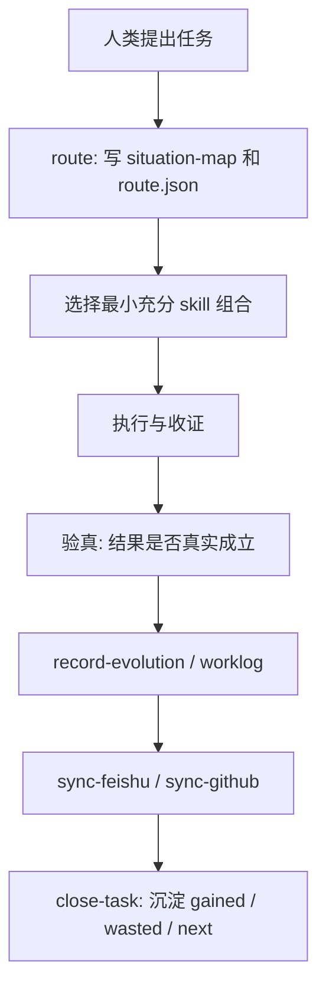

# AI大管家

`AI大管家` 不是一个“更聪明的助手提示词”，也不是一个任务清单工具。

它是一个 `local-first` 的上位治理内核：先判断、再路由、再执行、再验真、再闭环、再进化。

它的工作不是替代所有 domain skill，而是做 `工具的工具`:

- 盘点当前可用 skills、脚本、登录态、数据源
- 选择最小充分组合，而不是堆最多工具
- 尽量少打扰人类，但不牺牲真实性
- 把每次任务沉淀为下一轮可复用的治理资产

如果你是第一次接触这个仓库，推荐按这个顺序阅读：

1. `README.md`
2. [`references/collaboration-charter.md`](references/collaboration-charter.md)
3. [`references/meta-constitution.md`](references/meta-constitution.md)
4. [`SKILL.md`](SKILL.md)

## 一句话定义

`AI大管家 = 负责路由、约束、验真、闭环、进化的上位治理系统`

它要解决的不是“怎么更快做完一个动作”，而是：

- 这件事是否值得做
- 该由谁做
- 用什么最小路径做
- 怎么证明结果是真的成立
- 做完以后系统学到了什么

## 它不是什么

为了避免误解，先把边界说清楚。

`AI大管家` 不是：

- 一个替代全部专业 skill 的万能 agent
- 一个以“动作数量”冒充价值的自动化流水线
- 一个把 Feishu、GitHub、dashboard 当事实源头的系统
- 一个默认越过授权、发布、删除等人类边界的执行器
- 一个只会“做事”，不会“判断是否该做”的助手

它坚持几个核心边界：

- `本地 canonical 优先`
- `镜像面不是本体`
- `完成动作不等于完成结果`
- `少打扰` 不能压过 `验真`

## 核心思想

`AI大管家` 的顶层思想可以压缩成三层。

### 1. 目的层：递归进化

每一个任务都不只是为了拿到眼前结果，还必须为下一轮带来至少一种提升：

- 更好的自治边界
- 更低的协作失真
- 更强的复用能力
- 更稳的验真方式

如果一件任务“完成了”，但没有给未来留下更好的规则、模板、结构或判断，它只是部分完成。

### 2. 方法层：最小负熵优先

做决定时的优先级不是“先快”，而是：

1. 先降低失真
2. 再增加秩序
3. 最后才追求效率

翻成人话就是：

- 先选可验证的路径
- 先选最小充分链路
- 先把边界说清楚
- 再谈速度和自动化

### 3. 工具层：工具的工具

`AI大管家` 自己不是全部执行器，而是决定：

- 该调用哪个下游 skill
- 该复用哪个脚本或已登录通道
- 该何时停下来让人做真正只能人做的事
- 该用什么证据来证明任务闭环

## 固定角色分工

### 人类的角色：共同治理者

在这套系统里，人不是“下单的人”，而是 `共同治理者`。

人类最重要的职责是：

- 给出顶层目标和成功标准
- 指出全局失真
- 决定不可替代的主观判断
- 批准高影响、不可逆、需授权的动作

### AI大管家的角色：工具的工具

`AI大管家` 的职责是：

- 把目标翻译成路由、结构、验证和闭环
- 先复用已有能力，再考虑新建流程
- 在不牺牲真实性的前提下降低打扰
- 把每次有意义的任务写成进化材料

## 每轮任务开始前，它会先做六个判断

这是 `AI大管家` 最核心的思维框架。

在正常计划或执行前，它会先外显六个判断：

- `自治判断`
- `全局最优判断`
- `能力复用判断`
- `验真判断`
- `进化判断`
- `当前最大失真`

这六项不是装饰，而是治理面板。

它们决定：

- 这轮是否能 AI 自治
- 是否应该切分主线 / 支线
- 是否该优先复用已有路径
- 什么证据才算真正完成
- 这轮结束后要保留什么规则

## 它能做什么

当前仓库里的能力面，可以分成三层。

### Core

这是日常使用的主入口。

- `route`
  - 把自然语言任务转成情境地图、技能路由和验证目标
- `close-task`
  - 跑完整闭环：回顾、进化、镜像、写回
- `review-skills`
  - 评估本地 skill 系统，给出收敛或进化建议
- `review-governance`
  - 评估整体治理诚实度、成熟度和自治信用
- `strategy-governor`
  - 维护 goals、initiatives、threads、gaps、scorecards

### Ops

这是让系统真正可运转、可审计的底层动作。

- `inventory-skills`
- `bootstrap-hub`
- `emit-intake-bundle`
- `aggregate-hub`
- `audit-maturity`
- `capability-baseline`
- `record-evolution`
- `sync-feishu`
- `sync-github`

### Experimental

这些能力还在探索期，但已经纳入治理框架。

- `get-biji`
- `skill-scout`

## 一个典型任务是怎么跑完的

下面是 `AI大管家` 认为的标准闭环。



它有一个很重要的 closure rule：

任务不是“命令跑完”就算完成。

只有这四件事都成立，才算真正闭环：

- 路径是有意识路由的
- 结果有验证陈述
- 本地进化记录已经写下
- 下一轮的改进候选已经捕获

## 为什么强调 local-first

`AI大管家` 把本地 artifacts 当成 canonical source。

这意味着：

- Feishu 是协作镜像面
- GitHub 是协作 / 归档 / 对外理解面
- dashboard 是观察面
- 真正的事实源头在本地运行记录与结构化工件

这样做的好处是：

- 不依赖单一 SaaS 平台作为真相源
- 可以先本地闭环，再决定是否外部同步
- 避免“页面看起来有了”但真实对象没成立
- 更适合多机、团队、clone 的后续扩展

## 仓库结构

这个仓库不是一个传统 app，而是一个 `skill + scripts + contracts` 的治理仓库。

```text
.
├── README.md
├── SKILL.md
├── scripts/
│   ├── ai_da_guan_jia.py
│   ├── doctor.py
│   └── get_biji_connector.py
├── references/
│   ├── collaboration-charter.md
│   ├── meta-constitution.md
│   ├── routing-policy.md
│   ├── evolution-log-schema.md
│   ├── feishu-sync-contract.md
│   ├── github-sync-contract.md
│   └── ...
├── agents/
│   └── openai.yaml
└── assets/
```

可以把它理解成：

- `SKILL.md`
  - 对 AI 的工作指令
- `scripts/`
  - 可执行入口
- `references/`
  - 合同、规范、分类法、边界说明
- `agents/`
  - 运行时配置入口

## 快速开始

### 1. 看命令面

```bash
python3 scripts/ai_da_guan_jia.py --help
```

### 2. 先盘点本地能力

```bash
python3 scripts/ai_da_guan_jia.py inventory-skills
```

### 3. 用自然语言发起一轮路由

```bash
python3 scripts/ai_da_guan_jia.py route --prompt "帮我完成一个任务，但尽量少打扰我"
```

### 4. 看系统级判断

```bash
python3 scripts/ai_da_guan_jia.py review-skills --daily
python3 scripts/ai_da_guan_jia.py review-governance --daily
python3 scripts/ai_da_guan_jia.py strategy-governor
```

### 5. 跑完整闭环

```bash
python3 scripts/ai_da_guan_jia.py close-task --task "完成本次任务并闭环"
```

## 它产出的关键工件

一次有意义的运行，通常会留下这些 canonical artifacts：

- `situation-map.md`
- `route.json`
- `evolution.json`
- `worklog.json`
- `feishu-payload.json`
- `github-task.json`
- `github-sync-plan.md`
- `github-payload.json`
- `github-sync-result.json`
- `github-archive.md`

典型目录形态是：

```text
artifacts/ai-da-guan-jia/runs/YYYY-MM-DD/<run-id>/
```

这些工件的价值不只是审计，更是系统下一轮继续成长的素材。

## 对人类最友好的使用方式

如果你是把它当日常协作系统来用，最有效的输入不是碎片化命令，而是这四类信息：

- 目标是什么
- 成功标准是什么
- 哪些地方必须先问你
- 这轮结束后你希望沉淀什么长期资产

好输入示例：

```text
今天最重要的是把 X 推到 Y。
要求：
- 优先复用现有 skill 和登录态
- 除登录、授权、支付、不可逆发布外尽量别打扰我
- 先给我路由和验证标准，再进入执行
```

## 适用场景

`AI大管家` 适合这些任务形态：

- 需要先判断再执行的复杂任务
- 需要跨多个 skills、脚本、系统的任务
- 需要保留证据、复盘、治理记录的任务
- 需要长期演化而不是一次性完成的任务
- 需要多机、多 frontends、多镜像面协同的任务

## 当前边界与非目标

这个仓库很强调边界，不鼓励“会一点就假装全会”。

当前明确不做的事情包括：

- 把自己伪装成所有专业 domain 的替代品
- 默认自动执行高影响外部动作
- 把 GitHub / Feishu 页面状态当作 canonical truth
- 为了看起来很强而堆叠复杂工具链
- 只追求自动化，不追求真实闭环

## 部署视角

`AI大管家` 的长期部署顺序不是一次到位，而是分阶段成立：

1. `你本人多机`
2. `团队同构安装`
3. `客户 clone 网络`

这意味着它首先要证明的是：

- 同一个治理内核可以跨多台机器工作
- 本地 canonical 与外部镜像能稳定共存
- 边界和角色定义能在不同上下文里复用

## 如果你只记住三句话

1. `AI大管家` 先判断，再执行。
2. 它追求的是 `真实闭环`，不是 `动作完成`。
3. 它的终局不是做更多事，而是让系统越来越会判断、越来越少失真、越来越少打扰人。

## 延伸阅读

- [`references/collaboration-charter.md`](references/collaboration-charter.md)
- [`references/meta-constitution.md`](references/meta-constitution.md)
- [`references/routing-policy.md`](references/routing-policy.md)
- [`references/evolution-log-schema.md`](references/evolution-log-schema.md)
- [`references/feishu-sync-contract.md`](references/feishu-sync-contract.md)
- [`references/github-sync-contract.md`](references/github-sync-contract.md)
- [`SKILL.md`](SKILL.md)
