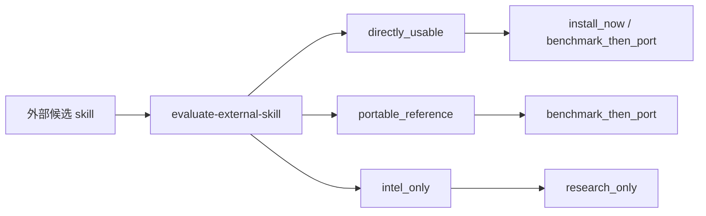

# AI大管家 外部 Skill 吸收矩阵 v1

## 1. 一句话结论

这批外部 skill 不应该被“全装进来”，而应该被拆成四层：

- `可立即整合`
- `需适配后整合`
- `保持外部底座`
- `仅做外部情报`

真正值得 AI大管家 长期吸收的，不是“更多仓库”，而是这些仓库里反复出现的结构能力：

- 产品化壳层
- 工作流拆分
- 验真机制
- 跨 runtime 适配边界
- 持续学习/自进化

## 2. 评估方法

本轮只用一套口径看外部资产，不再被星数、包装感或社区热度带偏。

### 2.1 统一评估契约

外部 skill 先过这四个问题：

1. runtime 是否和当前系统兼容？
2. 是否依赖私有的人类素材？
3. 输出是否可验证？
4. 能否变成长期复用资产？

再看五个镜头：

1. 产品化壳层
2. 工作流拆分
3. 验真机制
4. 跨 runtime 适配
5. 持续学习 / 自进化

### 2.2 本轮已经跑过的代表性评估卡

- [Context7 评估卡](/Users/liming/Documents/codex-ai-gua-jia-01/artifacts/ai-da-guan-jia/external-skill-evals/2026-03-25/adagj-external-skill-20260325-092708/evaluation-card.md)
- [Context Optimization 评估卡](/Users/liming/Documents/codex-ai-gua-jia-01/artifacts/ai-da-guan-jia/external-skill-evals/2026-03-25/adagj-external-skill-20260325-092826/evaluation-card.md)
- [Systematic Debugging 评估卡](/Users/liming/Documents/codex-ai-gua-jia-01/artifacts/ai-da-guan-jia/external-skill-evals/2026-03-25/adagj-external-skill-20260325-092911/evaluation-card.md)
- [Task Master AI 评估卡](/Users/liming/Documents/codex-ai-gua-jia-01/artifacts/ai-da-guan-jia/external-skill-evals/2026-03-25/adagj-external-skill-taskmaster-20260325-092930/evaluation-card.md)
- [Firecrawl 评估卡](/Users/liming/Documents/codex-ai-gua-jia-01/artifacts/ai-da-guan-jia/external-skill-evals/2026-03-25/adagj-external-skill-20260325-092826-02/evaluation-card.md)
- [Codebase Memory MCP 评估卡](/Users/liming/Documents/codex-ai-gua-jia-01/artifacts/ai-da-guan-jia/external-skill-evals/2026-03-25/adagj-external-skill-codebase-memory-20260325-092955/evaluation-card.md)
- [GPT Researcher 评估卡](/Users/liming/Documents/codex-ai-gua-jia-01/artifacts/ai-da-guan-jia/external-skill-evals/current/latest-evaluation.json)
- [Tavily 评估卡](/Users/liming/Documents/codex-ai-gua-jia-01/artifacts/ai-da-guan-jia/external-skill-evals/2026-03-25/adagj-external-skill-20260325-092741/evaluation-card.json)
- [AutoResearch 评估卡](/Users/liming/Documents/codex-ai-gua-jia-01/artifacts/ai-da-guan-jia/external-skill-evals/2026-03-22/adagj-external-skill-20260322-073709/evaluation-card.json)
- [moonstachain/claude-code 深度整合报告](./moonstachain-claude-code-deep-integration-report-v1.md)

### 2.3 读法提醒

- `directly_usable` 不等于自动收编进 core。
- `intel_only` 不等于没价值，往往只是当前不该进接入队列。
- `runtime_mismatch` 不等于不能用，而是要把它留在 tool/bridge 层，不要误升成治理内核。

## 3. 吸收矩阵

### 3.1 可立即整合

这些项的共同点是：能直接补当前 AI大管家 的空白，且可以用现有治理框架承接。

| 代表项 | 当前判断 | 为什么值得现在整合 | 后续使用方式 |
| --- | --- | --- | --- |
| `Context7` | `directly_usable / install_now` | 适合做官方文档、版本差异、陌生库学习的前置工具 | 作为 docs-first / benchmark-first 入口，不进 skill core |
| `Context Optimization` | 结构可直接映射 | 直接提升 token 与上下文效率 | 接到上下文压缩与路由层 |
| `Systematic Debugging` | 结构可直接映射 | 适合做根因分析和调试顺序控制 | 接到 `ai-metacognitive-core` 与调试 playbook |
| `Task Master AI` | `directly_usable / install_now` | 适合做 PRD -> task -> 执行的规划桥 | 先和 `task-spec`、`self-evolution-max` 做 benchmark，再决定是否 canonical 化 |
| `File Search` | 结构可直接映射 | 补强代码库深搜与定位能力 | 作为 preflight / 代码导航层 |
| `PDF Processing` | 结构可直接映射 | 与现有 `pdf` 能力高度同构 | 统一成文档工作流 adapter |
| `DOCX` | 结构可直接映射 | 与现有 `doc` 能力同类 | 统一成文档工作流 adapter |
| `PPTX` | 结构可直接映射 | 与现有 `slides` 能力同类 | 统一成文档工作流 adapter |
| `XLSX` | 结构可直接映射 | 与现有 `spreadsheet` 能力同类 | 统一成表格工作流 adapter |
| `Doc Co-Authoring` | 结构可直接映射 | 强化协作写作与分段接力 | 接到文稿协作 / 续写流程 |
| `Frontend Design` | 结构可直接映射 | 直接补设计系统、UI 质量和视觉语法 | 接到 `agency-design` / `figma` 的产出层 |
| `Canvas Design` | 结构可直接映射 | 适合做海报、社媒图、活动视觉 | 接到视觉产出 adapter |
| `Algorithmic Art` | 结构可直接映射 | 适合做风格探索和视觉实验 | 只取方法，不抬成 core |
| `Theme Factory` | 结构可直接映射 | 适合做主题、色板和 token 生成 | 接到设计系统/品牌规则 |
| `Web Artifacts Builder` | 结构可直接映射 | 适合快速生成小型交互物件和 dashboard | 接到 Web artifact / dashboard adapter |
| `Brand Guidelines` | 结构可直接映射 | 适合把品牌规范变成自动约束 | 接到品牌守护与设计验真 |
| `Skill Creator` | 结构可直接映射 | 直接帮助技能生成和方法沉淀 | 作为 skill 生产入口 |

#### 当前已验证可用

- `Context7`：`python3 scripts/check_codex_mcp.py` 已返回 `ready`
- `Task Master AI`：在 `Node 22` 路径下运行 `python3 scripts/check_task_master_ai.py` 已返回 `ready`
- `Task Master AI` 的当前可用前提是先把 `PATH` 切到 `/opt/homebrew/opt/node@22/bin`
- 完整可用清单见 [Context7 与 Task Master AI 可用验证清单 v1](/Users/liming/Documents/codex-ai-gua-jia-01/docs/ai-da-guan-jia-context7-task-master-ready-checklist-v1.md)

### 3.2 需适配后整合

这些项有价值，但不能直接照搬，原因通常是：契约太宽、需要私有素材、或更适合作为方法样本。

| 代表项 | 当前判断 | 为什么不能直接收编 | 适配方式 |
| --- | --- | --- | --- |
| `Excel MCP Server` | 需适配后整合 | 更像外部表格工具桥，不是 skill core | 先做本地表格工作流 adapter，再决定是否接入 |
| `NotebookLM Integration` | 需适配后整合 | 知识卡片/思维导图/闪卡有价值，但边界容易被外部产品形态绑住 | 只吸收结构，不照搬产品语法 |
| `Obsidian Skills` | 需适配后整合 | 容易混入私有笔记、风格 DNA、历史语料 | 仅在 canonical knowledge log 明确后做适配 |
| `Marketing Skills` | 需适配后整合 | 涉及增长、文案、邮件、CRO，多子域耦合强 | 拆成 `agency-marketing` 的子 playbook |
| `Claude SEO` | 需适配后整合 | 更适合做 SEO 审计方法样本，不宜直接变成全局入口 | 先做审核清单，再局部吸收 |
| `Remotion` | 需适配后整合 | 是视频生成 runtime，不是治理 skill 本体 | 只接到视频产出桥，不进 core |
| `Superpowers` | 需适配后整合 | 子 skill 很多，方法覆盖广，但边界噪音也大 | 只抽取高频子 playbook，不整包收编 |

### 3.3 保持外部底座

这些项目的价值主要在 runtime、框架、引擎或基础设施层。它们能连接，但不该被误当成 skill core。

| 代表项 | 当前判断 | 为什么保持外部 | 在 AI大管家 里的位置 |
| --- | --- | --- | --- |
| `LangGraph` | 保持外部底座 | 编排框架，不是 skill 方法本体 | 只作为编排运行时候选 |
| `AutoGPT` | 保持外部底座 | 老牌 agent runtime，价值在 engine 层 | 只做参考对照 |
| `OWL` | 保持外部底座 | agent 框架属性强 | 不直接收编 |
| `Dify` | 保持外部底座 | 平台型 runtime | 只做工具层连接 |
| `CrewAI` | 保持外部底座 | 多代理运行时 | 不进 skill core |
| `CopilotKit` | 保持外部底座 | 前端/应用层协同工具 | 只做交互接入候选 |
| `Ollama` | 保持外部底座 | 本地模型运行时 | 只做模型层桥接 |
| `Open WebUI` | 保持外部底座 | 前台 UI/runtime | 不进入治理内核 |
| `LlamaFile` | 保持外部底座 | 模型分发/可执行容器 | 保持工具层 |
| `Unsloth` | 保持外部底座 | 训练/微调底座 | 只做模型工程底层候选 |
| `n8n` | 保持外部底座 | 自动化平台，不是治理 skill | 保持外部工作流底座 |
| `Langflow` | 保持外部底座 | 低代码 flow 编排 runtime | 只做可视化编排桥 |
| `Huginn` | 保持外部底座 | 自动化/监控引擎 | 不进 core |
| `Firecrawl` | 保持外部底座 | 搜索/抓取基础设施 | 可作为采集工具层 |
| `Vanna AI` | 保持外部底座 | 数据问答/SQL 问答基础设施 | 只做数据问答底座 |
| `Codebase Memory MCP` | 保持外部底座 | 代码记忆桥接工具 | 适合做记忆桥，不进 core |
| `DSPy` | 保持外部底座 | 程序化提示优化框架 | 只做方法参考 |
| `Spec Kit` | 保持外部底座 | 规格化/项目脚手架底座 | 只做工程底座参考 |
| `NemoClaw` | 保持外部底座 | 运行时/框架属性更强 | 保持工具层候选 |

### 3.4 仅做外部情报

这些项目现在最适合当信号源，不适合立刻进入接入队列。

| 代表项 | 当前判断 | 为什么只当情报 | 建议动作 |
| --- | --- | --- | --- |
| `GPT Researcher` | `intel_only / research_only` | 当前评估结果显示 runtime mismatch 和 unverifiable output 风险 | 只做外部研究信号 |
| `Tavily` | `intel_only / research_only` | 实测输出验证还不够稳，包装信号强于闭环证据 | 先保留，不进入接入队列 |
| `AutoResearch` | `intel_only / research_only` | 适合参考方法，不适合直接收编 | 只保留方法启发 |
| `Awesome Claude Skills` | 外部合集 | 更像目录入口，不是能力本体 | 仅作候选池 |
| `Anthropic Skills` | 外部合集 | 官方精选池，适合做采样，不适合整包收编 | 仅作参考源 |
| `Awesome Agents` | 外部合集 | 汇总页强、可执行弱 | 仅作候选信号 |
| `skillsmp.com` / `aitmpl.com/skills` / `skillhub.club` / `agentskills.io` / `agentskillshub.top` | 外部索引/市场 | 适合发现，不适合直接定性 | 只做发现与比选 |

## 4. 深度优化：以后怎么用

这部分才是关键。真正应该长期保留的，不是某一个仓库，而是把这些仓库抽象成 AI大管家 的能力型适配器。

### 4.1 文档工作流 adapter

吸收对象：

- `PDF Processing`
- `DOCX`
- `PPTX`
- `XLSX`
- `Doc Co-Authoring`

优化目标：

- 统一输入契约
- 统一输出契约
- 统一验真路径
- 统一版本/修订/批注处理

以后这类任务不要再按“文档工具”零散路由，而要按“文档工作流”路由。

### 4.2 设计产出 adapter

吸收对象：

- `Frontend Design`
- `Canvas Design`
- `Algorithmic Art`
- `Theme Factory`
- `Web Artifacts Builder`
- `Brand Guidelines`

优化目标：

- 把“设计好不好看”变成“是否符合设计语言 / 产物结构 / 验真门”
- 让设计从灵感集合变成规则集合
- 把风格、主题、布局、组件、验真拆开

### 4.3 研究 / docs lookup adapter

吸收对象：

- `Context7`
- 其余类似官方文档检索工具

优化目标：

- 让陌生库学习先走 docs-first
- 让版本差异、官方 API、最佳实践先进入证据层
- 让“先看文档再动手”成为固定路由，而不是临时建议

### 4.4 调试 / preflight adapter

吸收对象：

- `File Search`
- `Systematic Debugging`
- `Context Optimization`

优化目标：

- 先定位再修改
- 先缩上下文再决策
- 先根因分析再修复
- 减少伪完成和盲修

### 4.5 规划桥 adapter

吸收对象：

- `Task Master AI`

优化目标：

- PRD -> 任务 -> 执行 的结构化桥
- 任务拆解和进度推进的标准化
- 与 `task-spec`、`self-evolution-max` 的边界清晰化

这里的关键不是“装不装”，而是“谁是 canonical”：

- 如果它只是更强的规划桥，就作为桥
- 如果它真的比现有方案更稳，再考虑 canonical 化
- 如果只是重复已有能力，就不要制造双桥并行

### 4.6 知识 / 内容 adapter

吸收对象：

- `NotebookLM Integration`
- `Obsidian Skills`
- `Marketing Skills`
- `Claude SEO`
- `Remotion`
- `Superpowers`

优化目标：

- 知识先 canonical log，再做镜像
- 内容先结构化，再做传播
- 营销先拆成子 playbook，再做增长
- 视频生成和复杂 agent 框架只保留方法启发，不整包收编

## 5. 未来能复用的深层规则

### 5.1 四条硬边界

1. `canonical first, mirror later`
   - 先有本地真相，再做 Feishu / 其他镜像。
2. `verifiable output before promotion`
   - 先可验证，再谈提权。
3. `runtime mismatch => benchmark then port`
   - 运行时不完全同构时，不直接收编到 core。
4. `packaging-only signal => intel only`
   - 只有包装感、没有足够本地证据时，先留作情报。

### 5.2 建议的路由模式

### 5.3 未来的 canonical 判断标准

只有同时满足下面几项，才值得从“外部优秀样本”升级成“AI大管家 内部能力”：

- 真实解决当前 gap
- 输出可以本地验证
- 不依赖不可复现的私有材料
- 不破坏现有 route 边界
- 可以沉淀成长期资产，而不是一次性漂亮 demo

## 6. 本次部署顺序（吸收队列）

按这次你指定的优先级，后续吸收队列固定为：

1. `Context7` - `install_now`
2. `Context Optimization` - `benchmark_then_port`
3. `Systematic Debugging` - `benchmark_then_port`
4. `Task Master AI` - `benchmark_then_port`
5. `Firecrawl` - `benchmark_then_port`
6. `Codebase Memory MCP` - `benchmark_then_port`
7. `GPT Researcher` - `research_only`
8. `Tavily` - `research_only`

其中 `Systematic Debugging` 可与 `File Search` 结成一组调试/预检旁路，但不改变上面的主顺序。

## 7. 优先级 Top 10

如果只做 10 件事，优先级建议是：

1. 把 `Context7` 固化成 docs-first 的标准工具层入口。
2. 把 `Context Optimization` 接到上下文压缩与 route 前预检层。
3. 把 `Systematic Debugging` 固化成根因分析与调试顺序控制层，并把 `File Search` 作为旁路。
4. 把 `Task Master AI` 作为 PRD->task 桥做对照 benchmark，先和 `task-spec` / `self-evolution-max` 比。
5. 把 `Firecrawl` 作为采集桥保留在工具层，先做方法学吸收再谈 canonical 化。
6. 把 `Codebase Memory MCP` 作为记忆桥保留在工具层，先验证是否真的比现有 memory 路由更强。
7. 建 `文档工作流 adapter`，统一 `PDF / DOCX / PPTX / XLSX / co-authoring`。
8. 建 `设计产出 adapter`，统一 `Frontend / Canvas / Theme / Brand / Web Artifacts`。
9. 把 `GPT Researcher`、`Tavily` 固定为 intel-only 信号源，不进当前接入队列。
10. 把外部 skill intake 的评价结果写回路由规则和验证清单，避免下次重复判断。

## 8. 结论

这批外部 skill 的正确用法，不是“装得越多越强”，而是：

`把可复用模式转成 AI大管家的适配器，把不可验证的包装信号留在情报层，把 runtime / framework 维持在工具底座层。`

这样做的好处是：

- 以后新增 skill 时，不会每次都从零判断
- 以后做路由时，能直接按边界和证据分流
- 以后做治理时，可以把真正的增量沉淀成规则，而不是目录堆叠

日常版速查表见 [AI大管家 外部 Skill 默认路由表 v1](/Users/liming/Documents/codex-ai-gua-jia-01/docs/ai-da-guan-jia-external-skill-default-routing-table-v1.md)。
