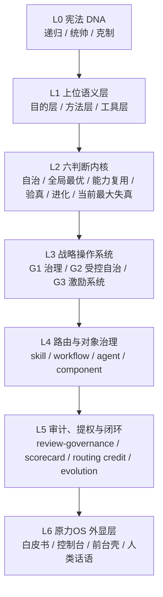

# AI大管家 治理吸收总报告 v1

## 1. 一句话结论

结论先说死：

`原力OS 的治理内核已经被 AI大管家 吸收并扩展了，但吸收的是治理能力与制度职责，不是把 os-yuanli 整包装进当前主机当新的 runtime root。`

所以当前成立的关系是：

- `AI大管家 = 唯一顶层治理入口`
- `原力OS = 人类外显层`
- `治理系统 = 多层治理栈，不再只用 3×3 解释全部`

旧判断里“3×3 就是全部顶层设计”这句话，到当前主机状态已经不够用了。  
现在更准确的说法是：

`3×3 仍然是方法核来源之一，但 AI大管家 已经把它扩展成 8 个治理维度、7 层治理分层、4 类治理对象、4 类激励杠杆和 1 条正式闭环链。`

## 2. AI大管家 当前顶层设计

### 2.1 顶层设计总图

当前主机上的 `AI大管家`，不是一个“会路由的 skill 集合”，而是一套多层治理系统。

它的压缩表达式是：

`3 个 DNA 模块 × 3 个上位语义层 × 6 个判断器 × 3 个战略目标 × 4 类治理对象 × 4 级自治层 × 4 个激励杠杆 × 1 条正式闭环链`

这就是当前主机顶层设计的骨架。

### 2.2 分层图

### 2.3 当前 live 快照

按当前主机 live 工件重算，今天这套治理系统至少已经长成：

- `8 个治理维度`
- `159 个治理对象`
  - `108 skill`
  - `9 workflow`
  - `5 agent`
  - `37 component`
- `4 个 active initiative`
  - `I-GOV-001`
  - `I-AUTO-001`
  - `I-INC-001`
  - `I-CLONE-001`
- `当前成熟度分布`
  - `Mid = 50`
  - `Low = 109`
  - `High = 0`

所以这套系统已经不是概念期，但也还没有到“全面高成熟”的稳定态。

## 3. 现状盘点：已吸收了什么

### 3.1 八个治理维度总表

| 治理维度 | 当前模块 / 分层 | 当前 live 证据 | 当前状态 |
| --- | --- | --- | --- |
| 宪法 DNA 维度 | `递归 / 统帅 / 克制` | `meta-constitution.md` | `已吸收并内生化` |
| 上位语义维度 | `目的层 / 方法层 / 工具层` | `collaboration-charter.md` | `已吸收并内生化` |
| 判断内核维度 | `六判断` | `ai-da-guan-jia/SKILL.md` | `已吸收并内生化` |
| 战略操作系统维度 | `G1 / G2 / G3` + `4 active initiatives` | `strategy/current/*` | `已吸收并制度化` |
| 治理对象维度 | `skill / workflow / agent / component` | `governance/current/governance-object-ledger.json` | `已吸收并制度化，但成熟度偏低` |
| 组织编排维度 | `clusters + inventory layers + routing discipline` | `org-taxonomy.md` + `routing-policy.md` | `已吸收并部分制度化` |
| 提权激励维度 | `自治层级 + scorecard + levers` | `autonomy-tier.json` + `object-scorecard.json` + `incentive-decision.json` | `已吸收但未完全制度化` |
| 闭环进化维度 | `route -> verify -> local evolution -> next iterate` | `record-evolution` / `close-task` / `evolution-log-schema` | `已吸收并制度化，但 honesty gate 仍未完全收平` |

### 3.2 各维度当前状态

#### 1. 宪法 DNA 维度

这层现在已经稳定了：

- `递归`：每个任务都是进化材料
- `统帅`：AI大管家 负责总路由和最小充分 skill 组合
- `克制`：少打扰、少浪费、但不能拿“省事”换伪闭环

这一层已经不是 benchmark，而是当前主机的第一性原理。

#### 2. 上位语义维度

这层也已经被正式写进合作宪章：

- `目的层 = 递归进化`
- `方法层 = 最小负熵优先`
- `工具层 = 工具的工具`

这意味着当前系统已经不再只回答“做什么”，而是在回答：

- 为什么做
- 按什么方法做
- 哪些工具只是被治理的器官

#### 3. 判断内核维度

原力OS 的 `六判断` 已经被 AI大管家 默认化了：

- `自治判断`
- `全局最优判断`
- `能力复用判断`
- `验真判断`
- `进化判断`
- `当前最大失真`

这层已经完全进入 `AI大管家` 的任务入口，不再需要通过外部 `os-yuanli` 才能启动。

#### 4. 战略操作系统维度

这一层当前已经形成正式战略面：

- `G1 治理操作系统化`
- `G2 受控自治与提案推进`
- `G3 AI 组织激励系统`

同时也已经有 4 个 active initiative：

- `I-GOV-001 统一治理视图`
- `I-AUTO-001 提案自治引擎`
- `I-INC-001 AI 激励评分体系`
- `I-CLONE-001 AI管家克隆体训练工厂`

所以原力OS 里“治理不是零散动作，而是操作系统主线”这件事，已经被完整吸收到当前主机战略层。

#### 5. 治理对象维度

这是当前系统已经明显超出原始 3×3 说法的地方。  
当前治理对象已经明确分成：

- `skill = 108`
- `workflow = 9`
- `agent = 5`
- `component = 37`

也就是说，AI大管家 当前治理的不是“技能仓”而是“治理对象集合”。  
这层已经制度化，但成熟度分布仍然偏早期：

- `Mid = 50`
- `Low = 109`
- `High = 0`

#### 6. 组织编排维度

这层当前已经具备明确 taxonomy。

当前 cluster 分布：

- `agency簇 = 56`
- `垂直workflow簇 = 18`
- `平台簇 = 24`
- `AI大管家治理簇 = 7`
- `技能生产簇 = 3`

当前 inventory layer 分布：

- `专家角色层 = 56`
- `垂直工作流层 = 18`
- `平台/工具集成层 = 24`
- `元治理层 = 10`

这说明原力OS 的“对象系统和编排语言”不只是被保留了，而且已经向 `taxonomy + inventory + routing` 扩张。

#### 7. 提权激励维度

这一层已经存在，但仍然是当前最大“半制度化区”之一。

已经稳定存在的激励杠杆：

- `调用权`
- `自治权`
- `资源权`
- `进化权`

已经稳定存在的 scorecard / gate：

- `honesty gate`
- `verification gate`
- `boundary gate`
- `closure score`
- `routing credit`

但这层需要讲清楚两个口径：

- `目标分层口径` 是 4 层：
  - `observe`
  - `suggest`
  - `trusted-suggest`
  - `guarded-autonomy`
- `当前运行口径` 默认从 `suggest` 起步  
  因为战略契约已经写死：默认自治等级是 `建议 + 待批`

所以今天看到的 live 数据是：

- `object-scorecard.json` 里保留了 4 层评分桶
- `autonomy-tier.json` 里运行中的提权账本主要活跃在 3 个 bucket：
  - `suggest = 94`
  - `trusted-suggest = 12`
  - `guarded-autonomy = 2`

这不是冲突，而是说明：

`四层是目标分层模型，三层是当前已激活的运行分层。`

#### 8. 闭环进化维度

这一层已经被 AI大管家 内生化得很深：

- 任务必须有 intentional route
- 必须有 verification statement
- 必须有本地 evolution record
- 必须有 `gained / wasted / next iterate`

但这一层还没有完全收平。  
当前 control tower 明确给出：

- `System Status = unsettled`
- `AI大管家 honesty score = 66.54`
- honesty gate 仍低于 `70` 这条 hard gate

也就是说，闭环能力已经吸收了，但“自身治理的诚实度”仍是当前主机必须继续修的一条主线。

同时，当前 governance review context 仍是 `baseline_only`，主要 blocker 还是：

- `hub_transport_not_ready`
- `missing_sources`
- `governance_feishu_not_configured`

所以这份报告表达的是“治理吸收状态”，不是“全组织正式 ready 已经完成”。

## 4. 原力OS 原能力 -> AI大管家 吸收映射

| 原力OS 原能力 | 原能力证据 | AI大管家 当前等价能力 | 吸收状态 | 当前 live 载体 | 剩余 gap | 下一步补齐 |
| --- | --- | --- | --- | --- | --- | --- |
| `治理OS × 工作OS` | `os-yuanli/SKILL.md` + `constitution.md` | `混合 governor + route / verify / evolve` | `已吸收并内生化` | `ai-da-guan-jia/SKILL.md` + `meta-constitution.md` | 还没有把全部任务族 pack 显式制度化 | 把 task-family pack 写成正式制度层 |
| `六判断` | `constitution.md` | `AI大管家 任务入口默认六判断` | `已吸收并内生化` | `ai-da-guan-jia/SKILL.md` | 无结构性缺口 | 继续作为固定入口，不再回退 |
| `3×3 方法核` | `constitution.md` + `os-yuanli/SKILL.md` | `8 维治理栈 + 7 层治理图` | `已吸收但未完全制度化` | `meta-constitution` + `collaboration-charter` + `strategy/current` | 仍缺统一“3×3 到 8 维”的对外说明书 | 用本报告作为正式解释层 |
| `task-family adaptive pack` | `task-family-map.md` | `按任务类型切路由与输出，但还未全量 pack 制度化` | `已吸收但未完全制度化` | `route` + `routing-policy` + 各类 review/output contract | 尚未统一为全任务族 artifact pack 体系 | 先补 `研究审计 / 工作流自动化 / 治理协作` 的 pack 制度 |
| `audit-rubric` | `audit-rubric.md` | `honesty / maturity / governance` 三评分面 | `已吸收并内生化` | `governance-review-contract.md` + `governance/current/*` | rubric 解释层还不够人类友好 | 增加治理评分解释页 |
| `system-audit playbook` | `system-audit-playbook.md` | `review-governance` + `review-skills` + `strategy-governor` + `evaluate-external-skill` | `已吸收并内生化` | `AI大管家` 原生命令 | 当前仍是 `baseline_only` 阶段，不是正式全组织 ready | 先补 transport、卫星纳管和 governance mirror |
| `Feishu audit loop boundary` | `system-audit-feishu-loop.md` | `本地 canonical first，Feishu only mirror` | `已吸收并内生化` | `collaboration-charter` + `sync contracts` | 外部镜像还不是每条链都稳定 | 继续保持 mirror 边界，不让 Feishu 反客为主 |
| `intent-grounding` | `os-yuanli` 器官包 | 任务压缩、done condition、人类边界抽取已内嵌到 AI大管家 入口 | `已吸收但未完全制度化` | `route` + `situation-map` + `record-evolution` 输入整理 | 还不是独立可编排器官 | 抽成主机正式器官 |
| `skill-router` | `os-yuanli` 器官包 | `inventory-skills` + `routing-policy` + `route` | `已吸收但未完全制度化` | `route.json` + `routing-policy.md` | 还缺更强的 task-family aware router | 器官化吸收并加 family pack aware |
| `evidence-gate` | `os-yuanli` 器官包 | `verification_result` + honesty gate + closure gate | `已吸收但未完全制度化` | `governance-review-contract` + `evolution-log-schema` | 仍缺独立 evidence gate 话语层 | 抽成单独 gate contract |
| `closure-evolution` | `os-yuanli` 器官包 | `record-evolution` + `validated-evolution-rules` + writeback rules | `已吸收但未完全制度化` | `闭环进化` 全链 | 还未完全显式器官化 | 抽为主机标准器官，并与 promotion rule 对齐 |
| `visible operator shell` | 原力OS 白皮书、控制台、前台壳 | `原力OS` 继续做人类前台与概念壳 | `保留为外显层` | `yuanli_os_control.py` + `feishu_claw_bridge.py` | 需要继续稳定前台体验，但不能抢 root | 继续前台化，不上升为总控 |
| `standalone root protocol` | `os-yuanli` root skill 定义 | 当前主机不采纳为第二个 root | `仍为 benchmark / bridge` | `os-yuanli benchmark mirror` + 外部 skill eval | 不能与 AI大管家 并列运行 | 维持 benchmark 身份，只吸收方法核 |

这张表最关键的一行不是“已吸收了很多”，而是：

`AI大管家 吸收的是治理能力，不是把 os-yuanli 整包 runtime 化。`

## 5. 目标完备态

这套治理系统的目标不是停在 `3×3`，而是长成一个更完整但仍可解释的治理系统。

### 5.1 目标结构

目标完备态固定是：

- `3 个 DNA 模块`
  - `递归`
  - `统帅`
  - `克制`
- `3 个上位语义层`
  - `目的层`
  - `方法层`
  - `工具层`
- `6 个判断器`
  - `自治`
  - `全局最优`
  - `能力复用`
  - `验真`
  - `进化`
  - `当前最大失真`
- `3 个战略目标`
  - `G1`
  - `G2`
  - `G3`
- `4 类治理对象`
  - `skill`
  - `workflow`
  - `agent`
  - `component`
- `4 级自治层`
  - `observe`
  - `suggest`
  - `trusted-suggest`
  - `guarded-autonomy`
- `4 个激励杠杆`
  - `调用权`
  - `自治权`
  - `资源权`
  - `进化权`
- `1 条正式闭环链`
  - `intentional route -> verification -> local evolution -> next iterate`

### 5.2 目标态意味着什么

到这个状态时，系统不再需要靠口头解释“我已经吸收了原力OS”，因为它会直接满足下面这些条件：

- 人类能看懂顶层设计
- 每个治理维度都有 live ledger
- 每类对象都能被统一审计
- 自治层不只存在于 scorecard，也存在于运行权限
- 任务族有明确 artifact pack
- 原力OS 前台壳稳定存在，但不和治理引擎争根

## 6. Gap 与补齐顺序

当前最大失真不是“没吸收原力OS”，而是：

`已经吸收了很多治理能力，但仍有一部分停在“内嵌责任”而不是“显式制度器官”。`

所以补齐顺序必须固定，不然系统会先长壳、后补骨，顺序会反。

### 1. `任务族 artifact pack 制度化`

当前问题：

- 已经有 family sense
- 还没有统一任务族 pack 制度

补齐后退出条件：

- 至少 `研究审计 / 工作流自动化 / 治理协作` 三类任务都能走固定 pack

### 2. `intent-grounding / skill-router / evidence-gate / closure-evolution` 器官化吸收

当前问题：

- 这些能力已经大部分被 AI大管家 吸收
- 但还不是独立的、可治理的显式器官

补齐后退出条件：

- 四个器官都有主机侧 contract、边界和验证方法

### 3. `workflow / agent / component` 治理对象进一步成熟

当前问题：

- 对象类型已经长出来了
- 但成熟度仍是 `Low 109 / Mid 50 / High 0`

补齐后退出条件：

- 至少出现稳定的 `High` bucket
- governance review 不再长期停在 `baseline_only`

### 4. `business deputy` 从 `public / private / sales` 提纯

当前问题：

- 原力OS 不是二号总控
- 业务副手还没有完全显式化

补齐后退出条件：

- `business deputy` 成为正式 subject / module / scorecard 组合

### 5. `原力OS` 外显层继续稳定前台，不上升为 root

当前问题：

- 前台壳存在
- 但很容易被误解成“第二个总控”

补齐后退出条件：

- 所有前台文案都保持：
  - `AI大管家 = 治理引擎`
  - `原力OS = 外显层`

## 附录

完整的 `MECE 维度 / 模块 / 分层 / 缺口 / 补齐路径` 矩阵，放在：

`docs/ai-da-guan-jia-governance-absorption-matrix-v1.md`

## 证据基线

本报告只采用当前主机 live 工件与本地 benchmark mirror：

- `ai-da-guan-jia/references/meta-constitution.md`
- `ai-da-guan-jia/references/collaboration-charter.md`
- `ai-da-guan-jia/references/strategic-governor-contract.md`
- `ai-da-guan-jia/references/governance-review-contract.md`
- `ai-da-guan-jia/references/incentive-scorecard-contract.md`
- `artifacts/ai-da-guan-jia/strategy/current/*`
- `artifacts/ai-da-guan-jia/governance/current/*`
- `tmp/external-repos/os-yuanli/*`
- 既有本地主机 / 原力OS 审计文档

如果这些 live 工件与旧报告冲突，以 `current` 工件为准。  
这也是本报告相对于旧判断最重要的一条更新规则。
