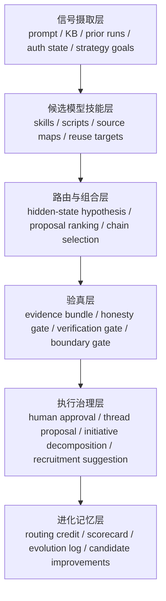

# AI大管家 Medallion / IBM 提案自治蓝图 v1

这份蓝图回答 4 个固定问题：

1. 大奖章 / IBM 这套方法论到底是什么。
2. 它是怎样从研究哲学变成可执行软件工程的。
3. 它与 `AI大管家` 在哪里同构，哪里必须改写。
4. 如果把它挂到 `I-AUTO-001 提案自治引擎`，第一性原理和架构边界应当怎样定义。

## 六个治理判断

- `自治判断`
  这轮可以高自治完成，真正的人类边界只在战略拍板与高影响执行授权，不在研究与蓝图收束本身。
- `全局最优判断`
  最优路径不是新开 initiative，而是直接加厚现有 `G2 / I-AUTO-001`，让研究材料成为方法论母板。
- `能力复用判断`
  复用现有 `AI大管家` 宪章、六判断、战略层对象、Feishu 提取证据和 IBM / ACL 主来源，不另造平行术语体系。
- `验真判断`
  每个核心结论必须标注为 `事实` 或 `推断`；事实只落在 Feishu 主材料与 IBM / ACL / CMU / Simons Foundation 等高可信来源上。
- `进化判断`
  终点不是“写懂大奖章”，而是把这套方法压成 `提案自治 contract`，供后续 runtime 和 scorecard 接入。
- `当前最大失真`
  把“量化神话”误听成“黑箱崇拜”，或者把“收益最大化”原样照搬为 AI 大管家的目标函数。

## 证据底座

### 本轮主材料

- Feishu 主文档提取：
  - `/tmp/feishu-reader-qqa3/result.json`
  - `/tmp/feishu-reader-qqa3/result.md`
- Feishu 补充滚动提取：
  - `/tmp/feishu-reader-qqa3-scroll.json`

### 外部主来源

- [Peter Brown | Carnegie Mellon University - CSD50](https://www.cs.cmu.edu/csd50/peter-brown)
- [Peter Brown | Carnegie Mellon University Computer Science Department](https://www.csd.cmu.edu/academics/doctoral/degrees-conferred/peter-brown)
- [Robert L. Mercer receives the 2014 ACL Lifetime Achievement Award](https://www.aclweb.org/portal/node/2502)
- [Design of a Linguistic Statistical Decoder for the Recognition of Continuous Speech | IBM Research](https://research.ibm.com/publications/design-of-a-linguistic-statistical-decoder-for-the-recognition-of-continuous-speech)
- [A Tree-Based Statistical Language Model for Natural Language Speech Recognition | IBM Research](https://research.ibm.com/publications/a-tree-based-statistical-language-model-for-natural-language-speech-recognition)
- [A Maximum Likelihood Approach to Continuous Speech Recognition | IBM Research](https://research.ibm.com/publications/a-maximum-likelihood-approach-to-continuous-speech-recognition)
- [A Statistical Approach to Machine Translation | ACL Anthology](https://aclanthology.org/J90-2002/)
- [The Mathematics of Statistical Machine Translation: Parameter Estimation | ACL Anthology](https://aclanthology.org/J93-2003/)
- [Class-Based n-gram Models of Natural Language | ACL Anthology](https://aclanthology.org/J92-4003/)
- [Word-sense disambiguation using statistical methods | IBM Research](https://research.ibm.com/publications/word-sense-disambiguation-using-statistical-methods)
- [Remembering Jim Simons | Simons Foundation](https://www.simonsfoundation.org/about/our-history/remembering-jim-simons/)

## 一、这套体系到底是什么

### 1.1 历史事实层

- `事实`
  Peter Brown 在 CMU 获得计算机博士，导师是 Geoffrey Hinton；之后在 IBM Watson 做了 9 年研究工作。[CMU](https://www.csd.cmu.edu/academics/doctoral/degrees-conferred/peter-brown) [CMU CSD50](https://www.cs.cmu.edu/csd50/peter-brown)
- `事实`
  Robert Mercer 在 IBM 的长期工作与统计语言处理、语音识别和机器翻译密切相关，ACL 对其 lifetime achievement 的表述也明确强调了他对统计 NLP 的奠基性贡献。[ACL](https://www.aclweb.org/portal/node/2502)
- `事实`
  IBM 相关论文明确表明，这一研究脉络的核心不是手工规则，而是最大似然、统计解码、语言模型、HMM、搜索与参数估计。[IBM Research](https://research.ibm.com/publications/design-of-a-linguistic-statistical-decoder-for-the-recognition-of-continuous-speech) [IBM Research](https://research.ibm.com/publications/a-maximum-likelihood-approach-to-continuous-speech-recognition)
- `事实`
  Brown / Mercer 共同处在统计机器翻译、n-gram / class-based language model、词义消歧等一组相互耦合的研究链条上，而不是孤立单点成果。[ACL Anthology](https://aclanthology.org/J90-2002/) [ACL Anthology](https://aclanthology.org/J93-2003/) [ACL Anthology](https://aclanthology.org/J92-4003/) [IBM Research](https://research.ibm.com/publications/word-sense-disambiguation-using-statistical-methods)
- `事实`
  Feishu 主材料已经把这条迁移关系压缩为一句关键判断：从“预测下一个词”到“预测下一个价格”，并把市场视为可观测信号与隐藏状态的映射问题。证据见 `/tmp/feishu-reader-qqa3/result.json`。

### 1.2 方法论抽象层

- `推断`
  大奖章真正吸收的不是一组 NLP 算法，而是一整套关于复杂系统的认识论：
  - 先承认世界充满噪声
  - 再把噪声中的可重复结构转成统计问题
  - 再把统计问题变成训练、搜索、验证、执行的工程管线
- `推断`
  所以这套体系本质上是：
  `信号化世界观 + 隐状态建模 + 统计实证 + 组合研究 + 自动执行纪律`

## 二、它如何工程化

### 2.1 五个方法轴

#### 轴 1：信号化建模

- `事实`
  IBM 的语音识别和语言模型论文都把输入首先视为序列信号，而不是先验解释文本。[IBM Research](https://research.ibm.com/publications/design-of-a-linguistic-statistical-decoder-for-the-recognition-of-continuous-speech) [IBM Research](https://research.ibm.com/publications/a-tree-based-statistical-language-model-for-natural-language-speech-recognition)
- `推断`
  迁移到 AI 大管家时，用户 prompt、KB 返回、历史 run、工具可用性、权限状态、反馈标签，都应先被视为“信号”，而不是直接视为“结论”。

#### 轴 2：隐状态推断

- `事实`
  HMM、最大似然解码、统计翻译对齐都依赖“观测值背后存在隐藏结构”的问题设定。[IBM Research](https://research.ibm.com/publications/a-maximum-likelihood-approach-to-continuous-speech-recognition) [ACL Anthology](https://aclanthology.org/J93-2003/)
- `推断`
  在 `AI大管家` 里，真实用户目标、可接受边界、组织优先级、风险等级，本质上都是隐藏状态，不是 prompt 表层文字。

#### 轴 3：经验验证优先于叙事

- `事实`
  IBM / ACL 论文链条反复强调的是 perplexity、likelihood、alignment、error reduction、decoding quality 这类可测量结果，而不是哲学陈述。[IBM Research](https://research.ibm.com/publications/a-tree-based-statistical-language-model-for-natural-language-speech-recognition) [IBM Research](https://research.ibm.com/publications/word-sense-disambiguation-using-statistical-methods)
- `推断`
  对提案自治来说，这意味着“proposal quality”不能只由语言说服力决定，必须由 evidence bundle、历史命中、边界一致性和闭环质量共同决定。

#### 轴 4：模型组合优于单一教条

- `事实`
  IBM 的统计识别系统不是单模型崇拜，而是语言模型、声学模型、搜索算法、词典、翻译对齐等多部件耦合体系。[IBM Research](https://research.ibm.com/publications/design-of-a-linguistic-statistical-decoder-for-the-recognition-of-continuous-speech) [IBM Research](https://research.ibm.com/publications/automatic-speech-recognition-in-machine-aided-translation)
- `推断`
  `AI大管家` 也不应追求“一个总模型包打天下”，而应追求 governor + skills + scripts + KB + human approval gate 的最小充分组合。

#### 轴 5：软件工程化执行

- `事实`
  Feishu 主材料第 3、5 节把 Brown / Mercer 的核心价值总结为“单体模型思想”和“工程化可执行系统”，并进一步给出 HMM 升级、Transformer 序列化、可微组合优化等 2026 版迁移路径。证据见 `/tmp/feishu-reader-qqa3-scroll.json`。
- `推断`
  对 `AI大管家` 来说，最应学习的不是某种模型结构，而是“如何把理论目标压成一套一贯的 route / verify / approve / evolve 机制”。

## 三、它与 AI大管家 的同构与异构

### 3.1 同构部分

| IBM / 大奖章方法核 | AI大管家 中的等价层 |
| --- | --- |
| 观测信号 | user prompt / KB answer / prior runs / auth state |
| 隐状态 | 真实目标 / 真实约束 / 风险 / 优先级 |
| 解码 / 搜索 | route / candidate ranking / proposal sorting |
| 多模型耦合 | governor + skill chain + script + human gate |
| 回测 / 验证 | verification gate / closure gate / review |
| 研究积累 | evolution log / routing credit / scorecard |

### 3.2 必须改写的地方

- 金融的目标函数是 `收益最大化`。
- `AI大管家` 的目标函数不能照搬，必须改写为：
  `最小失真 + 真闭环 + 递归进化`

这是结构级改写，不是措辞优化。否则系统会被短期高命中、高速度、高表面满意度牵着走，最终退化为“高执行幻觉机器”。

### 3.3 必须拒绝的地方

- 拒绝把大奖章神话化为“黑箱天才公式”
- 拒绝把单次成功误当成长期能力
- 拒绝把单一分数误当成总治理质量
- 拒绝让提案自治越过人类高影响边界直接执行

## 四、六判断映射

| 六判断 | 提案自治中的新定义 |
| --- | --- |
| `自治判断` | 只在提案、排序、证据组织层高自治，不跨越高影响执行边界 |
| `全局最优判断` | 先求整条治理链条最优，不求单个 skill 的局部最优 |
| `能力复用判断` | 优先复用历史 run、routing credit、KB、已认证工具链 |
| `验真判断` | 提案必须带 evidence bundle，不能只给漂亮语言 |
| `进化判断` | 每轮 proposal 结果都要反哺 scorecard、credit、template |
| `当前最大失真` | 把“像样的提案”误当成“经过验证的提案” |

## 五、`I-AUTO-001` 的 6 层架构蓝图

### 分层解释

- `信号摄取层`
  从大奖章方法里吸收“先把世界视为信号序列”的立场。
- `候选模型技能层`
  从 IBM 方法里吸收“系统从来不是单模型”的立场。
- `路由与组合层`
  对应隐藏状态推断与解码，不直接输出动作，先输出 hypothesis。
- `验真层`
  把量化里的 out-of-sample 思维翻译为提案 gate。
- `执行治理层`
  提案只到待批，不越权执行高影响动作。
- `进化记忆层`
  把每轮成败写回治理信用，而不是只保留会话表面文本。

## 六、提案自治公共 contract v1

### 输入

- `user_prompt`
- `kb_answer`
- `strategic_goals`
- `initiative_registry`
- `prior_runs`
- `routing_credit`
- `auth_state`

### 中间层

- `hidden_state_hypothesis`
- `proposal_candidates`
- `reuse_vs_new_judgment`
- `evidence_bundle`
- `boundary_assessment`

### 输出

- `thread_proposal`
- `initiative_decomposition`
- `skill_recruitment_suggestion`
- `blocked_reason`

### 门控

- `honesty_gate`
- `verification_gate`
- `boundary_gate`
- `human_approval`

### 非目标

- 不直接执行高影响动作
- 不把单次路由结果自动固化为长期制度
- 不以速度代替证据

## 七、吸收 / 改写 / 拒绝 矩阵

| 类别 | 内容 |
| --- | --- |
| `吸收` | 统计实证、隐状态视角、模型组合、持续校准、工程纪律 |
| `改写` | 从收益最大化改写为最小失真 + 真闭环 + 递归进化 |
| `拒绝` | 黑箱崇拜、单指标成败论、短期效果冒充长期能力 |

## 八、对你有没有参考价值

### 判断矩阵

| 问题 | 判断 | 原因 |
| --- | --- | --- |
| 对你的 AI 大管家设计有没有价值 | `高价值` | 你最稀缺的不是“知道大奖章厉害”，而是“理解怎样把方法论压成软件工程事实” |
| 能不能原样照搬 | `不能` | 目标函数不同，协作对象不同，边界不同 |
| 最值得迁移的是什么 | `研究治理系统` | 不是某个模型，而是研究、验证、执行、演化的一体化机制 |
| 最大风险是什么 | `误吸收` | 把量化的高压单目标误带进多目标治理系统 |

### 你的最佳用法

- 把自己当作 `方法论迁移者`，不是传奇故事解释员。
- 把大奖章经验用于定义 `proposal autonomy` 的结构和 discipline。
- 把 “市场像语言” 降级为高价值隐喻，而不是把价格序列和 NLP 做机械等同。

## 九、第一轮落地结论

这次研究对 `AI大管家` 的最佳挂载位置不是 `G1` 的解释层补充，也不是孤立研究线程，而是：

`G2 / I-AUTO-001 提案自治引擎` 的方法论母蓝图

它给这个 initiative 提供了 4 个此前不够明确的上位约束：

1. 提案首先是隐藏状态推断，不是文案生成。
2. 提案必须自带证据门控，不是语言说服。
3. 提案引擎必须是组合系统，不是单 skill 自动化。
4. 提案自治的目标函数必须是低失真闭环，而不是短期“看起来有用”。
