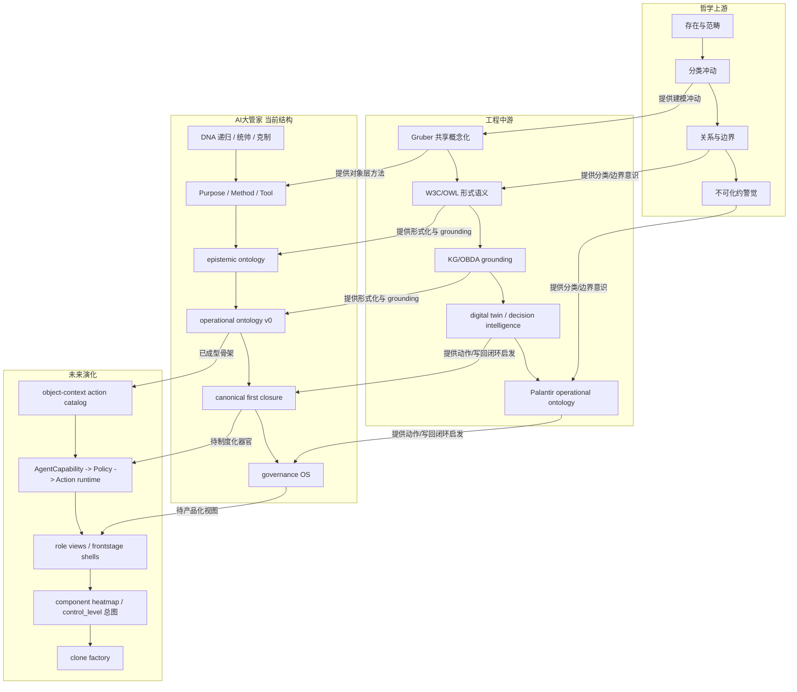

# AI大管家 理论母图 v1

## 不混写声明

这份母图严格区分四个层次，不把它们混成一个“大本体论”：

- `哲学本体论`：讨论“什么存在、如何分类、边界如何成立”的上游问题。
- `知识工程 ontology`：讨论“如何把共享概念化明确表达并形式化”的中游方法。
- `Palantir operational ontology`：讨论“如何把对象、关系、状态、动作、权限、回写、审计接成企业运行时中枢”的工程化架构。
- `AI大管家 的双 ontology 结构`：`epistemic ontology` 管知识分层与边界纪律，`operational ontology` 管对象、动作、权限、写回和闭环。

说明：

- `[主读本直接可见]` 指本轮会话中用户提供的《本体论的前生今世》正文摘录；仓库内不重复落原文。
- `[图像直接可见]` 指本轮会话中用户提供的 Palantir `Ontology` 架构图。

## 1. 一句话总纲

`AI大管家` 真正吸收的，不是“古典哲学本体论的全部答案”，而是 `先建立稳定对象世界，再在其上绑定关系、边界、动作、证据和协作接口` 的建模原则；这套原则经过 `知识工程 ontology` 和 `Palantir operational ontology` 的工程化中继，已经在当前系统里长成 `DNA -> Purpose/Method/Tool -> 双 ontology -> canonical first closure` 的骨架，并正走向更完整的治理操作系统。

## 2. 六个判断

- `自治判断`：除非碰到授权、付款、发布、删除、审批或不可替代主观取舍，否则这类理论收束工作应由 `AI大管家` 自主完成，不再把结构判断回抛给人类。
- `全局最优判断`：最稳的总图不是“一个聊天壳解释一切”，而是 `前台壳 / 治理核 / 执行层 / 镜像层` 分离；理论母图要服务这个分离，而不是掩盖它。
- `能力复用判断`：优先复用现有 [meta-constitution.md](/Users/liming/Documents/codex-ai-gua-jia-01/work/ai-da-guan-jia/references/meta-constitution.md)、[collaboration-charter.md](/Users/liming/.codex/skills/ai-da-guan-jia/references/collaboration-charter.md)、[operational-ontology-v0.md](/Users/liming/Documents/codex-ai-gua-jia-01/specs/operational-ontology-v0.md)、[operational-ontology-implementation-plan-v0.md](/Users/liming/Documents/codex-ai-gua-jia-01/specs/operational-ontology-implementation-plan-v0.md) 和 [06-palantir-to-yuanli-os-mapping.md](/Users/liming/Documents/codex-ai-gua-jia-01/derived/research/palantir-yuanli-2026-03-11/06-palantir-to-yuanli-os-mapping.md)，不另造一套漂浮话术。
- `验真判断`：以 `本地图示 + 本地白皮书 + 本地 operational ontology 文档 + 官方一手外部资料` 为准；哲学延伸只做谨慎类比，不冒充直接设计来源。
- `进化判断`：这份图不只是一次解释，而是以后写白皮书、做 frontstage 壳、解释 clone factory、做 control tower 时可复用的总图母版。
- `当前最大失真`：最危险的误读有两个，一是把 `前台聊天顺滑` 误当 `canonical 后脑闭环`，二是只学 `ontology` 这个词，不学 `action / policy / writeback / audit` 这条硬链。

## 3. 主母图

## 4. 四层谱系解码

### 4.1 哲学上游：不是拿来直接写 schema，而是提供建模冲动

- `[主读本直接可见]` 主读本最有营养的地方，不是给出某个最终形而上学答案，而是持续追问：`世界里到底有哪些稳定存在、哪些分类是真有约束力的、哪些边界不能乱抹平。`
- `[高可信推断]` 这正好对应 `AI大管家` 今天最需要的上游纪律：不要把线程、任务、证据、决策、动作、权限、前台会话混成一个“都算上下文”的大口袋。
- `[背景补证]` [Stanford Encyclopedia of Philosophy: Ontology and Information Systems](https://plato.stanford.edu/entries/ontology-is/) 也强调，信息系统里的 ontology 价值，不在于夸大形而上学姿态，而在于帮助软件系统对对象与区别做出更清楚、更可操作的承诺。

### 4.2 工程中游：从“问存在”转向“可共享、可表达、可 grounding”

- `[背景补证]` [Gruber 1993](https://tomgruber.org/writing/ontolingua-kaj-1993/) 把 ontology 的经典工程转折点定在 `explicit specification of a conceptualization`，也就是“共享概念化的明确规范”。
- `[背景补证]` [W3C OWL 2 Overview](https://www.w3.org/TR/owl-overview/) 进一步把 ontology 推到 `formal semantics`、`machine interpretable`、`interoperable` 的层面，让对象、类、关系和约束可以被更严格地表达。
- `[高可信推断]` `KG/OBDA grounding`、`digital twin`、`decision intelligence` 则把 ontology 从“表达”继续推进到“接现实、接逻辑、接动作”的中层通路。

### 4.3 Palantir operational ontology：不是知识目录，而是企业运行时中枢

- `[图像直接可见]` 你给的图里，`Ontology` 被放在中间层，上接 `AI + Human Teaming`、`Analytics & Workflows`、`Automations`、`Products & SDKs`，下接 `Data Sources`、`Logic Sources`、`Systems of Action`。
- `[图像直接可见]` 这意味着 Palantir 图里的 `Ontology` 不是“分类表”，而是把对象、关系、状态、逻辑、动作和角色视图绑在一起的 `operational layer`。
- `[背景补证]` [Palantir Ontology Overview](https://www.palantir.com/docs/foundry/ontology/overview/) 直接把 ontology 讲成组织的运行层，并把 `actions`、`functions`、`dynamic security` 一起放进来；[Palantir Platform Overview](https://www.palantir.com/docs/foundry/platform-overview/overview/) 则强调它是把数据、逻辑、应用和人机协作接起来的中枢。

### 4.4 AI大管家 当前结构：最成熟的不是哲学叙事，而是双 ontology 骨架

- `[本地文档直接可见]` [meta-constitution.md](/Users/liming/Documents/codex-ai-gua-jia-01/work/ai-da-guan-jia/references/meta-constitution.md) 给了 `递归 / 统帅 / 克制` 的执行 DNA。
- `[本地文档直接可见]` [collaboration-charter.md](/Users/liming/.codex/skills/ai-da-guan-jia/references/collaboration-charter.md) 把这套 DNA 提升成 `Purpose / Method / Tool` 的上位语义层。
- `[本地文档直接可见]` [operational-ontology-v0.md](/Users/liming/Documents/codex-ai-gua-jia-01/specs/operational-ontology-v0.md) 已经把 `EvidenceAtom / Entity / Relation / State / Action / Policy / Permission / DecisionRecord / AgentCapability / WritebackEvent` 写成最小公共类型。
- `[本地文档直接可见]` [06-palantir-to-yuanli-os-mapping.md](/Users/liming/Documents/codex-ai-gua-jia-01/derived/research/palantir-yuanli-2026-03-11/06-palantir-to-yuanli-os-mapping.md) 又把 `epistemic ontology` 与 `operational ontology` 切开，明确说前者管知识对象与边界，后者管运行对象与动作闭环。
- `[高可信推断]` 所以 `AI大管家` 当前真正已经成型的，是 `双 ontology + canonical first closure`，不是“哲学本体论工程化完成”。

## 5. AI大管家 当前对应物

- `DNA 递归 / 统帅 / 克制`
  - `[本地文档直接可见]` 对应 [meta-constitution.md](/Users/liming/Documents/codex-ai-gua-jia-01/work/ai-da-guan-jia/references/meta-constitution.md)；它定义了低打扰、高复用、真闭环的第一性约束。
- `Purpose / Method / Tool`
  - `[本地文档直接可见]` 对应 [collaboration-charter.md](/Users/liming/.codex/skills/ai-da-guan-jia/references/collaboration-charter.md)；它把“任务完成”提升为“递归进化回合”的上位解释框架。
- `operational ontology v0`
  - `[本地文档直接可见]` 对应 [operational-ontology-v0.md](/Users/liming/Documents/codex-ai-gua-jia-01/specs/operational-ontology-v0.md)；这里是 `Entity / Action / Policy / Permission / WritebackEvent` 的正式骨架。
- `对象化动作与能力绑定的下一步`
  - `[本地文档直接可见]` 对应 [operational-ontology-implementation-plan-v0.md](/Users/liming/Documents/codex-ai-gua-jia-01/specs/operational-ontology-implementation-plan-v0.md)；这里已经把 `Action / DecisionRecord / AgentCapability / WritebackEvent` 的增量落地顺序写出来了。
- `双 ontology 的边界`
  - `[本地文档直接可见]` 对应 [06-palantir-to-yuanli-os-mapping.md](/Users/liming/Documents/codex-ai-gua-jia-01/derived/research/palantir-yuanli-2026-03-11/06-palantir-to-yuanli-os-mapping.md)；这里明确说 `epistemic ontology != operational ontology`。
- `canonical first closure / governance OS`
  - `[高可信推断]` 这是对以上几份文档和 `AI大管家` 现有 `route -> verify -> local evolution -> next iterate` 闭环的压缩命名，不是额外新增的一套空概念。

## 6. 借鉴吸收矩阵

| 维度 | 来源营养 | AI大管家 当前对应物 | 判断档位 | 说明 |
| --- | --- | --- | --- | --- |
| `对象世界` | `Gruber 共享概念化` + `Palantir object layer` | `Entity`、`Task/Thread/Asset/Skill`、`canonical entities` | `已明确吸收` | `[本地文档直接可见]` 对象优先已经写进 `operational ontology v0`。 |
| `关系与链接` | `ontology relation modeling` + `KG grounding` | `Relation`、`canonical/relations` | `高相似但未制度化` | `[高可信推断]` 已有关系结构，但还没有形成成熟的“对象视图驱动前台”的产品化层。 |
| `状态` | `digital twin` + `operational runtime state` | 各实体 `status`、运行阶段字段 | `高相似但未制度化` | `[本地文档直接可见]` 状态被承认，但还没完全成为动作、审批和 proposal 的统一驱动器。 |
| `动作` | `Palantir actions/functions` + `decision intelligence` | `Action`、`action-catalog-v0`、`resolve-action` | `值得新增吸收` | `[本地文档直接可见]` 动作语言已出现，但还没彻底完成 `object-context action catalog`。 |
| `权限/边界` | `dynamic security` + `policy/permission` | `Policy`、`Permission`、`AgentCapability`、`human boundary` | `高相似但未制度化` | `[高可信推断]` 边界语言已有，运行时强约束还需要继续加硬。 |
| `证据/回写/审计` | `grounding` + `writeback/audit chain` | `EvidenceAtom`、`DecisionRecord`、`WritebackEvent`、`close-task` | `已明确吸收` | `[本地文档直接可见]` 这是当前吸收最成熟的一段硬链。 |
| `人机协同入口` | `AI + Human Teaming` + `role views` | `共同治理者`、`工具的工具`、前台壳设想 | `高相似但未制度化` | `[图像直接可见]` 顶层协同语言已对上，但多角色视图和 frontstage 产品层仍偏早期。 |
| `知识本体 vs 操作本体` | `epistemic discipline` + `operational ontology split` | `epistemic ontology` / `operational ontology` 双层分工 | `已明确吸收` | `[本地文档直接可见]` 这是当前体系最先进也最该保住的边界。 |

## 7. 误吸收防火墙

- `不要把 Palantir Ontology 说成纯哲学本体论。`
  - `[图像直接可见]` 它在图里明显是企业运行时中枢，不是亚里士多德术语表。
- `不要把 canonical 夸大成完整企业 ontology 平台。`
  - `[高可信推断]` 现在的 `AI大管家` 更像治理核与运行骨架，还不是 Palantir 级全栈产品。
- `不要把 epistemic ontology 和 operational ontology 混写。`
  - `[本地文档直接可见]` 一个负责知识分层与边界，一个负责对象、动作、权限和回写；混写会直接导致 schema 和治理语言失真。
- `不要只学 ontology 名词，不学 action / policy / writeback / audit。`
  - `[背景补证]` Palantir 官方材料之所以硬，不在名词，而在动作、函数、动态权限和回写链路。
- `不要把 AI + Human Teaming 误读成 AI 完全自治。`
  - `[图像直接可见]` 图顶层明写 `operators / developers / analysts`，这是一套受控的人机共作，不是“人类退场”。
- `不要把哲学优雅感误当 runtime 完成度。`
  - `[高可信推断]` 说得很高级，不能替代 `对象是否定义、动作是否可执行、写回是否留痕、边界是否受控` 这四个硬问题。

## 8. 未来演化梯子

1. `概念分层已清`
   - `[本地文档直接可见]` 今天最重要的成果，是把 `哲学本体论 / 知识工程 ontology / Palantir operational ontology / AI大管家 双 ontology` 四层边界切清。
2. `对象与证据已立`
   - `[本地文档直接可见]` `Entity / EvidenceAtom / DecisionRecord / WritebackEvent` 已经足够支撑一个受控闭环骨架。
3. `动作与权限待制度化`
   - `[高可信推断]` 下一跳不是继续抽象，而是把 `object-context action catalog`、`AgentCapability -> Policy -> Action runtime` 真正接硬。
4. `多角色 frontstage 待产品化`
   - `[图像直接可见]` 要学的是 `AI + Human Teaming` 的产品层位置：不同角色通过不同视图看同一对象世界，而不是每个人都只看一段聊天。
5. `clone-scale 治理操作系统`
   - `[高可信推断]` 当对象、动作、权限、证据和多角色视图都稳定后，`AI大管家` 才真正具备服务多个 clone、多个 namespace、多个目标模型的治理核资格。

### 为什么这张母图重要

`AI大管家` 未来真正要做成的，不是“再多一个会聊天的壳”，而是把 `入口体验`、`治理真相`、`执行能力`、`协作分发` 从一团混合物里拆开；这张母图的价值，就在于把这个拆分的思想来源、当前骨架和未来方向一次性对齐。

### 参考锚点

本地锚点：

- [meta-constitution.md](/Users/liming/Documents/codex-ai-gua-jia-01/work/ai-da-guan-jia/references/meta-constitution.md)
- [collaboration-charter.md](/Users/liming/.codex/skills/ai-da-guan-jia/references/collaboration-charter.md)
- [operational-ontology-v0.md](/Users/liming/Documents/codex-ai-gua-jia-01/specs/operational-ontology-v0.md)
- [operational-ontology-implementation-plan-v0.md](/Users/liming/Documents/codex-ai-gua-jia-01/specs/operational-ontology-implementation-plan-v0.md)
- [06-palantir-to-yuanli-os-mapping.md](/Users/liming/Documents/codex-ai-gua-jia-01/derived/research/palantir-yuanli-2026-03-11/06-palantir-to-yuanli-os-mapping.md)

外部锚点：

- [Stanford Encyclopedia of Philosophy: Ontology and Information Systems](https://plato.stanford.edu/entries/ontology-is/)
- [Gruber 1993: A Translation Approach to Portable Ontology Specifications](https://tomgruber.org/writing/ontolingua-kaj-1993/)
- [W3C OWL 2 Web Ontology Language Document Overview](https://www.w3.org/TR/owl-overview/)
- [Palantir Ontology Overview](https://www.palantir.com/docs/foundry/ontology/overview/)
- [Palantir Platform Overview](https://www.palantir.com/docs/foundry/platform-overview/overview/)
