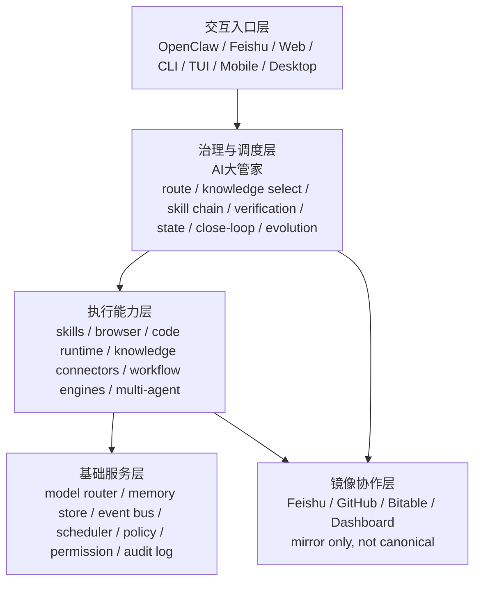

# OpenClaw × AI大管家 说明稿与战略蓝图 v1

这份稿子分两部分：

1. 先用人类能懂的话，解释你给的这张 `OpenClaw` 参考架构图到底在说什么。
2. 再基于当前仓库里已经存在的 `AI大管家`、`Feishu Claw Bridge`、`原力OS 前台 / AI大管家 后端` 白皮书，给出一个更稳定的未来蓝图。

先校正一个小口径：

- 你口头说的是 `Open Cloud` / `Open Crowd`
- 但图上的标题写的是 `OpenClaw`
- 当前仓库里的文档、桥接脚本、安装包说明，也统一使用 `OpenClaw / AutoClaw`

所以这份文档后面统一写 `OpenClaw`。

## 六个判断

- `自治判断`
  这轮可以直接基于现有图和仓库文档完成，不需要再打断你补定义。
- `全局最优判断`
  最稳的解释方式，不是把 OpenClaw 讲成“一个大模型产品”，而是把它讲成 `前台壳 + Agent 操作系统 + 能力编排层`。
- `能力复用判断`
  直接复用现有 [yuanli-os-ai-da-guan-jia-collaboration-whitepaper-v2.md](/Users/liming/Documents/codex-ai-gua-jia-01/docs/yuanli-os-ai-da-guan-jia-collaboration-whitepaper-v2.md)、[feishu-claw-bridge.md](/Users/liming/Documents/codex-ai-gua-jia-01/docs/feishu-claw-bridge.md)、[ai-da-guan-jia-openclaw-package.md](/Users/liming/Documents/codex-ai-gua-jia-01/docs/ai-da-guan-jia-openclaw-package.md)、[autoclaw-feishu-governance-framework.md](/Users/liming/Documents/codex-ai-gua-jia-01/docs/autoclaw-feishu-governance-framework.md)。
- `验真判断`
  这张图本身是参考图，不当作官方权威真源；图上能直接读出的内容和我基于本地系统做的推断，会明确分开。
- `进化判断`
  这次不是只解释一张图，而是顺手把“OpenClaw 和 AI大管家 应该怎么长期分工”沉淀成一张以后还能复用的总图。
- `当前最大失真`
  最容易失真的地方有两个：
  1. 把 `OpenClaw` 误当成唯一后脑。
  2. 把“聊天入口很顺”误当成“系统已经闭环”。

## Part 1. 用人话讲这张 OpenClaw 架构图

## 1.1 一句话先说透

如果只用一句话说：

`OpenClaw 不是一个模型，而是一套让模型、工具、记忆、消息渠道、界面和定时任务协同工作的 Agent 操作系统 / 前台壳。`

它像什么？

- 不像一个“聪明聊天框”
- 更像一个“AI 公司的总调度台”

你可以把它想成一座城市，或者一家公司：

- 最上面是各业务部门在干活
- 中间是各种通用能力部门在供能
- 再下面是基础设施和制度
- 最底下再接外部供应商与合作系统

这张图其实就是在画这四层。

## 1.2 第一层：应用层

应用层就是“这套系统最后拿来干什么”。

图里这一层大概分成几块：

- 自媒体运营
- 营销
- 设计
- 生产
- 运营
- 运维

如果翻译成人话，就是：

- 有的 Agent 帮你做内容策划、生成、发布、分析
- 有的 Agent 帮你做营销策划、投放、分析
- 有的 Agent 帮你做竞品分析、原型设计
- 有的 Agent 帮你做程序设计、自动测试
- 有的 Agent 帮你做数据分析、数据洞察
- 有的 Agent 帮你做指标监控、预警预报

所以应用层不是技术层。
应用层回答的是：

`这套系统最终服务哪些业务场景。`

这就像一家公司最上面那排不是“数据库”“网关”“缓存”，而是“市场部”“产品部”“研发部”“运营部”“客服部”。

## 1.3 第二层：能力层

能力层不是直接交付业务结果的部门，而是给上面那些应用部门供能的。

图里主要有六类：

### 1. 模型配置

比如：

- DeepSeek
- Ollama
- Qwen

这说明 OpenClaw 默认就不是只绑死一个模型。
它更像一个“模型插槽系统”：

- 你可以换模型
- 可以按任务切模型
- 也可以本地模型和云模型混着用

这再次证明：

`OpenClaw 本身不是模型，它是模型的组织者。`

### 2. 记忆管理

图里有：

- 会话记忆
- 长期记忆

这说明它在想的是：

- 这次对话里我刚刚说过什么
- 长期来看，这个用户、这个任务、这个系统过去积累了什么

也就是说，OpenClaw 不是“每次从零开始聊”。
它想做的是让 Agent 有连续性。

### 3. 消息通道

图里有：

- 飞书
- 钉钉
- 自定义

这说明它不是只活在自己的界面里。
它还想接到现实世界的沟通渠道里：

- 从飞书里收消息
- 把结果发回飞书
- 接公司内的协作流

换句话说，它有“通信系统”。

### 4. 能力拓展 Skills

图里有：

- 营销 skill
- 设计 skill
- 运营 skill
- 运维 skill
- 生产 skill

这块很像“插件市场”或者“技能工厂”。
意思是：

- OpenClaw 不靠一个大 prompt 包打天下
- 它希望把能力拆成可插拔 skill
- 每个 skill 服务一种明确任务族

所以你也可以把 OpenClaw 看成“Agent 平台”，而不只是“Agent 应用”。

### 5. 定时任务

图里有：

- 设置与触发
- 调度与执行
- 归档与通知

这说明它不只想做“你问我答”。
它还想做：

- 到点自动跑
- 定时监测
- 自动汇总
- 自动通知

这就从聊天工具，往“自动运行系统”走了。

### 6. UI

图里有：

- Webchat
- CLI
- TUI

这说明同一套后脑，可能有多种前台入口：

- 网页聊天
- 命令行
- 终端文本界面

所以 OpenClaw 的一个核心设计倾向就是：

`前台可以很多种，但能力底盘尽量共用。`

## 1.4 第三层：框架层

这一层最像城市地下系统，或者公司的基础设施与制度层。

图里有这些关键词：

- Gateway
- Agent Runtime
- Tool
- Memory
- Skills
- Plugin
- DM Policy
- Sandbox
- Browser
- Cron / Heartbeat
- Canvas / A2UI
- Multi-Agent
- 模型适配器
- 通道适配器
- 通用能力框架

如果全翻成大白话，可以理解成：

### Gateway

像总入口和总路由。
外面来的请求，先从这里进，再分给谁处理。

### Agent Runtime

像“Agent 在哪儿跑、怎么跑、怎么维持状态”的运行引擎。

### Tool / Plugin / Skills

像不同级别的能力插头：

- Tool 更像原子工具
- Skill 更像一个任务套路
- Plugin 更像一组扩展能力的接入件

### Memory

像统一记忆中台。
不是每个 Agent 各记各的，而是有一层公共记忆机制。

### Browser

说明它把网页操作当成正式能力，而不是额外小玩具。

### Cron / Heartbeat

说明系统是“活着的”。
它不是只在你发消息时才存在。

### Sandbox

说明它意识到 Agent 运行是有风险的，所以要有隔离层。

### Multi-Agent

说明它不是只准备养一个 Agent，而是允许多个 Agent 分工协作。

### DM Policy

这通常意味着权限、决策边界、调度规则、消息治理之类的“制度层”。

### 模型适配器 / 通道适配器 / 通用能力框架

这三块很关键，因为它们说明 OpenClaw 在做的是“标准化接入”：

- 模型别直接硬编码，要有适配层
- 通讯渠道别一条条乱接，要有通道适配层
- 通用能力别每次重造，要沉成公共框架

所以框架层回答的是：

`这些 AI 能力如何稳定、安全、可扩展地长期运行。`

## 1.5 第四层：外部工具层

图最底下那层接的是外部世界。

能看到的包括：

- OpenAI
- Claude
- DeepSeek
- Twitter
- 飞书
- 自定义
- Agent
- Skills
- Task

这说明 OpenClaw 的自我定位不是“自己包办一切”。
它更像一个总装车间：

- 上接各种模型供应商
- 外接各种业务系统和消息通道
- 再把这些拼成可跑的 Agent 体系

这也是为什么我更愿意把它叫：

`Agent 操作系统 / Agent 编排平台 / 前台总控壳`

而不只是“又一个 AI 应用”。

## 1.6 这张图真正表达的核心

如果把整张图压缩成三句话，它想表达的是：

1. `AI 不只是一段对话，而是一套业务系统。`
2. `业务系统不只需要模型，还需要记忆、工具、消息、UI、调度、规则和适配器。`
3. `真正能长期跑起来的，不是单个模型，而是整套协同底座。`

## 1.7 图上能确认的，和我做的推断

### 图上能直接确认的

- 它确实按四层在组织：`应用层 -> 能力层 -> 框架层 -> 外部工具层`
- 它确实在强调：模型、记忆、消息通道、技能、定时任务、UI、runtime、sandbox、browser、multi-agent
- 它确实在往“业务场景化 Agent 平台”方向想，而不只是聊天工具

### 我基于本地图和本地仓库做的推断

- 它适合作为 `前台壳 / Agent OS / 交互入口`
- 它不适合直接被理解成唯一 canonical 后脑
- 如果它和 `AI大管家` 结合，最稳的关系不是上下级包含，而是 `OpenClaw 做前台壳，AI大管家 做治理核`

也就是说：

`这张图很像在画一个 AI 工作平台；而 AI大管家 更像要坐在这个平台背后，负责“做对、做真、做闭环”。`

## Part 2. AI大管家 下再加 OpenClaw 的未来蓝图

## 2.1 一句话总纲

未来最稳的蓝图，不是：

- `AI大管家 下面挂一个 OpenClaw 子模块`

而是：

- `OpenClaw 负责前台壳与入口体验`
- `AI大管家 负责治理与调度`
- `下游执行能力网络 负责真正干活`
- `Feishu / GitHub / Bitable 负责镜像协作，不负责真相源`

换成一句最短的话：

`OpenClaw 负责让人更容易进入正确下一步，AI大管家 负责确保这个下一步真的对、可证、可追、可收。`

## 2.2 为什么不能把 OpenClaw 直接当后脑

当前仓库里的根定义已经很清楚：

- [yuanli-os-ai-da-guan-jia-collaboration-whitepaper-v2.md](/Users/liming/Documents/codex-ai-gua-jia-01/docs/yuanli-os-ai-da-guan-jia-collaboration-whitepaper-v2.md) 明确写了 `AI大管家` 是唯一后端治理核、唯一 canonical source、唯一闭环 owner。
- [ai-da-guan-jia-openclaw-package.md](/Users/liming/Documents/codex-ai-gua-jia-01/docs/ai-da-guan-jia-openclaw-package.md) 明确把 OpenClaw/AutoClaw 风格入口定义成“前台分流器”，不是执行层万能代理。
- [feishu-claw-bridge.md](/Users/liming/Documents/codex-ai-gua-jia-01/docs/feishu-claw-bridge.md) 现在已经把桥接层定位成 adapter，而不是第二后脑。
- [autoclaw-feishu-governance-framework.md](/Users/liming/Documents/codex-ai-gua-jia-01/docs/autoclaw-feishu-governance-framework.md) 更进一步把角色切成 `前台壳 / 治理层 / 执行层`。

所以从现有仓库逻辑往未来延长，最稳定的不是“谁吞掉谁”，而是“谁负责哪一层”。

## 2.3 未来总架构：五层蓝图

这个五层架构里，每一层各干各的。

## 2.4 第一层：交互入口层

这一层的目标只有一个：

`降低人进入系统的心智负担。`

这里面可以有很多入口：

- OpenClaw
- Feishu
- Web
- CLI
- TUI
- 手机端
- 桌面端

这一层负责的是：

- 接住自然语言
- 恢复最近上下文
- 告诉用户下一步该干什么
- 提供轻记录、轻查询、轻判断、轻收口准备

这一层不负责：

- 真正的长链执行
- 强验真
- 复杂多系统写入
- 生产级闭环归档

所以未来 OpenClaw 最合适的位置，就是这里：

`它是前台壳，不是唯一后脑。`

## 2.5 第二层：治理与调度层

这层就是 `AI大管家`。

它负责的事情应该继续固定为：

- route
- 选择知识源
- 选择技能链
- 编排执行顺序
- 判断是否触达人类边界
- 判断是否 ready to close
- 记录状态与证据
- 产出 evolution

也就是：

`人类问进来以后，到底要走哪条路，谁来做，做到什么程度才算真完成，这些都归 AI大管家。`

这一层是全系统真正的治理核。

它持有的 canonical 对象也应该继续单一化：

- `run`
- `task`
- `thread`
- `capture`
- `evidence`
- `memory governance`

这几个对象不应该被前台壳私有化。

## 2.6 第三层：执行能力层

这层才是真正干活的器官层。

它可以包括：

- skills
- browser automation
- code/runtime
- knowledge connectors
- workflow engines
- multi-agent 协作
- 定时任务引擎
- 外部 SaaS 接入器

这一层的关键不在“堆多少能力”，而在：

- 每个能力边界清不清楚
- 是否能被治理层审计
- 能不能回写证据
- 能不能被前台壳安全调用

换句话说：

`真正执行可以很多样，但必须被统一治理。`

## 2.7 第四层：基础服务层

基础服务层是整个系统“看不见但不能倒”的底座。

未来稳定版至少要有这些公共服务：

- `model router`
  统一决定任务用哪个模型，本地还是云端，便宜还是强。
- `memory store`
  统一管理短期记忆、长期记忆、任务记忆，而不是每个入口各记各的。
- `event bus / message bridge`
  统一处理 Feishu、Webhook、前台消息、通知、状态更新。
- `scheduler`
  统一处理 cron、heartbeat、定时巡检、批处理。
- `policy / permission`
  管授权、风控、审批边界、是否允许写外部系统。
- `audit log`
  记录谁触发、谁执行、写了什么、用了什么证据、为什么收口。

这一层是系统长期规模化的关键。

因为没有这层，前台越多，系统越乱；
能力越多，治理越假。

## 2.8 第五层：镜像协作层

这一层最容易被误解。

它包括：

- Feishu
- GitHub
- Bitable
- Dashboard
- 其他协作面

这层的职责不是当后脑，而是：

- 让人看见结果
- 让团队协作
- 让状态被分发
- 让汇总被消费

这层必须继续坚持一个原则：

`mirror only, not canonical`

也就是：

- 飞书消息不是 canonical memory
- GitHub issue 不是任务真相源
- OpenClaw 会话本身也不是 canonical object

任何前台聊天记录、飞书消息、OpenClaw 会话，都不能直接升格为 canonical memory；
必须先经过 `AI大管家` 的治理、归档和证据链。

## 2.9 四个角色的固定分工

未来稳定版，我建议把角色永远写死成这四个：

| 角色 | 定位 | 该做什么 | 不该做什么 |
| --- | --- | --- | --- |
| 人类 | 最终决策者 | 提目标、给偏好、做授权、做审批、做不可逆选择 | 不应该自己在一堆工具和 skill 之间来回切 |
| OpenClaw | 前台壳 | 接意图、恢复上下文、给下一步、做轻记录轻判断 | 不抢 canonical、不开假闭环 |
| AI大管家 | 治理核 | route、编排、验真、状态、收口、进化 | 不把“聊得顺”误当完成 |
| 执行能力网络 | 器官层 | 真正执行各类任务 | 不自行宣布闭环，也不私藏任务真相 |

这四者一旦分清，整个系统就稳。

## 2.10 OpenClaw -> AI大管家 的前台 contract

未来不需要一上来设计很重的协议。
当前仓库已经有一个很好的最小 contract 心智，可以继续往前长。

已有前台 contract 核心包括：

- `route_task`
- `ask_knowledge`
- `close_task`
- `get_run_status`
- `list_frontdesk_capabilities`
- `suggest_human_decision`
- `frontdesk_reply`

这套最小接口很重要，因为它决定了：

### 1. 前台接口

面向 OpenClaw / Feishu / Web / CLI 的轻量请求与状态回复。

典型问题是：

- 这件事该怎么走
- 现在卡哪了
- 有什么能力可用
- 这件事能不能收口
- 这一步是不是该你拍板

### 2. 治理接口

面向 `run lifecycle / route decision / verification status / human boundary / closure state`。

这类接口的作用不是“给用户看热闹”，而是保证系统里每个任务都有可追踪状态。

### 3. 执行接口

面向 `skills / tools / plugins / connectors` 的统一调用与审计回写。

它们的关键不是功能多，而是：

- 调用有边界
- 输出有证据
- 状态能回写
- 能被治理层审计

## 2.11 人类边界要继续收紧，而不是继续发散

未来版本里，人类边界反而应该更少、更清楚。

我建议继续固定只保留这些：

- 授权
- 付款
- 发布
- 删除
- 审批
- 不可替代的主观取舍

除此之外的：

- 路由
- 选择 skill
- 组织执行链
- 整理证据
- 生成总结
- 判断 ready / blocked / failed_partial

都应该越来越多地交给 `AI大管家` 自动完成。

这才叫受控自治。

## 2.12 从当前版本到成熟版的四阶段路线图

这里不讲空泛愿景，只讲从当前仓库现状怎么走。

## 阶段 1：先把 OpenClaw 稳定成前台壳

目标不是做大，而是先收敛定位。

这一阶段只做：

- 轻路由
- 轻知识
- 轻记录
- 轻判断
- 收口准备

也就是让 OpenClaw 明确成为：

`把人送到正确下一步的前台壳`

而不是：

- 万能执行器
- 第二后脑
- 第二任务系统

这一阶段的验收标准应该是：

- 前台入口足够顺手
- 能恢复 run 状态
- 能说明 next step
- 能说明 human boundary
- 不伪装成真正闭环

当前仓库已经部分具备这一阶段雏形：

- `feishu_claw_bridge.py`
- `frontdesk_reply`
- `route_task`
- `get_run_status`
- `suggest_human_decision`
- `bundle-status`

所以阶段 1 不是从零开始，而是从“已有桥接版”走向“更稳定的前台版”。

## 阶段 2：让 AI大管家 成为统一后脑

这一阶段的关键不是 UI，而是统一 canonical。

要打通的是：

- canonical capture
- run 状态
- task / thread / evidence
- route decision
- closure decision
- skill selection
- knowledge read path

到了这个阶段，系统必须彻底稳定一个根：

`OpenClaw 接住人，AI大管家 定义真相。`

如果这一阶段做不稳，后面一切“多入口、多 Agent、多客户”都会变成幻觉。

## 阶段 3：把执行层做成可插拔能力网络

当前很多系统会卡死在这里：

- 前台做得很花
- 后脑说得很漂亮
- 真正执行能力还是碎的

所以阶段 3 要补的是统一执行网络：

- skills
- browser
- multi-agent
- workflow engines
- 定时任务
- 外部 SaaS connectors

这阶段的重点不只是“接上去”，而是：

- 有统一调用面
- 有统一审计面
- 有统一状态回写
- 有统一权限边界

这样 OpenClaw 才不会沦为“只是一个好看的入口”，
AI大管家 也不会沦为“只是一个会写宏大文档的调度器”。

## 阶段 4：进入 clone factory 时代

这一阶段才是规模化的真正开始。

如果前 3 阶段稳定了，那么未来一个非常强的方向就是：

`同一个 AI大管家 治理核，服务多个 customer clone。`

这时要隔离的不是 skill 文件夹，而是：

- `clone_id`
- `memory_namespace`
- 目标模型
- 训练历史
- scorecard
- promotion / hibernation / budget proposal

也就是说，未来不是每个客户复制一套 AI。
而是：

- 一个共享治理核
- 多个被配置、被训练、被隔离的 clone 实例

这会让系统从“个人 AI 工作台”升级成“AI 管家工厂”。

## 2.13 当前版到未来版的关键跃迁

从系统演化角度看，真正的跃迁不是“功能更多”，而是下面四个东西被拆开了：

### 1. 入口体验

谁负责把人接住。

### 2. 治理真相

谁负责定义任务到底处于什么状态，证据够不够，是否真闭环。

### 3. 执行能力

谁负责真正做事。

### 4. 协作分发

谁负责把结果送给人、团队、看板、镜像系统。

过去很多 AI 系统的问题，就是把这四者搅成一团。

未来这套蓝图的价值，恰恰在于把它们拆开：

- `OpenClaw` 管入口体验
- `AI大管家` 管治理真相
- `执行能力网络` 管干活
- `Feishu / GitHub / Bitable` 管协作分发

这才是一个能长大的架构。

## 2.14 为什么这个架构对未来重要

因为未来真正复杂的，不是“模型会不会更聪明”，而是：

- 入口越来越多
- 渠道越来越多
- Agent 越来越多
- 客户 clone 越来越多
- 协作面越来越多
- 审计和边界要求越来越高

如果不把系统拆层，未来一定会出现三个问题：

1. `前台越来越像后脑，后脑越来越像聊天框`
2. `执行层越来越碎，谁也说不清真相在哪`
3. `镜像系统越来越多，最后没有一个是真正的 canonical`

而这套蓝图最重要的价值，就是防止系统长成一团混合物。

它不是“多装一个壳”。

它真正做的是把这四件事拆开：

- `入口体验`
- `治理真相`
- `执行能力`
- `协作分发`

只有拆开，系统才能：

- 对人更顺
- 对任务更真
- 对组织更稳
- 对未来更能复制

## 2.15 最后的压缩结论

如果最后再压成最短版本，我会这样说：

`OpenClaw 适合做 AI 系统的前台壳和 Agent 操作系统；AI大管家 适合做这套系统背后的治理核、真相源和闭环 owner。`

再往未来走，最强的形态不是“谁替代谁”，而是：

`前台壳负责接住人，治理核负责定义真相，执行网络负责干活，镜像协作层负责把结果送出去。`

这才是 `OpenClaw × AI大管家` 最值得长期坚持的蓝图。
