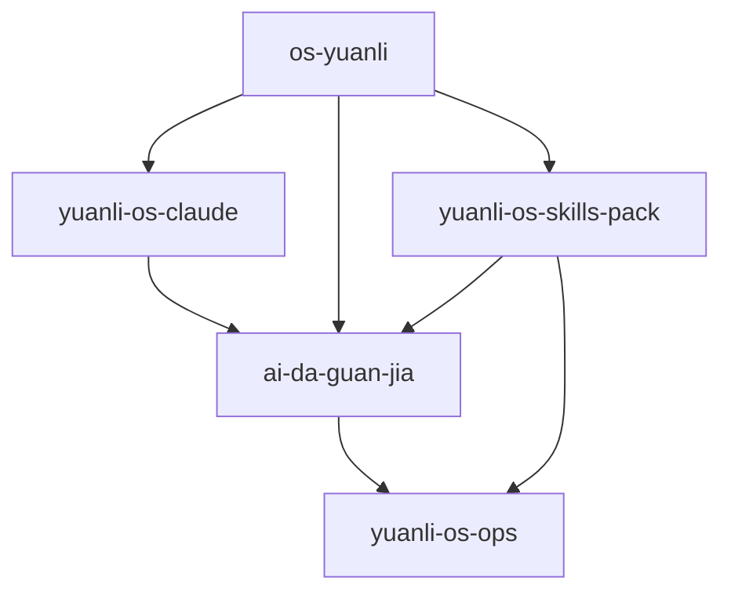

# GitHub Governance Spec

- Generated at: `2026-03-18T11:03:16.337153+08:00`
- Canonical owner: `work/ai-da-guan-jia/references/github-governance-spec.md`
- Scope: logical governance over `yuanli-os-claude / ai-da-guan-jia / yuanli-os-skills-pack / os-yuanli / yuanli-os-ops`.

## Reality Check

- This machine currently verifies only `yuanli-os-ops` and `yuanli-os-skills-pack` as active standalone clones.
- `yuanli-os-claude` has a verified backup clone, but the active working directory is embedded inside the workspace repo.
- `ai-da-guan-jia` and `os-yuanli` are present locally as workspace/skill copies, not as independent active clones.
- The active workspace root currently has `327` uncommitted entries and no configured git remote.

## Inventory Snapshot

| Repo | Local Mode | Default Branch | Tag Count | Uncommitted |
| --- | --- | --- | --- | --- |
| yuanli-os-claude | embedded_active_path_with_backup_clone | main | 0 | 1 |
| ai-da-guan-jia | embedded_directory_in_workspace_repo | n/a | 0 | 41 |
| yuanli-os-skills-pack | standalone_git_clone | main | 0 | 5 |
| os-yuanli | embedded_directory_in_workspace_repo | n/a | 0 | 1 |
| yuanli-os-ops | standalone_git_clone | main | 0 | 12 |

## Naming Standard

- Repository names stay English lowercase kebab-case only.
- Use Chinese only for README headings, issue titles, and human-facing summaries.
- Keep task keys in `tsk-YYYYMMDD-type-domain-slug-hash8` format.
- Use `codex/<goal>` for agent-created branches; do not commit long-lived work directly onto ad hoc branch names.

## Branch Strategy

- Protect `main` on every GitHub repo once each logical repo has an active standalone clone.
- Create short-lived implementation branches under `codex/`, `feat/`, `fix/`, or `docs/` depending on purpose.
- Merge through PRs for shared repos; local-only repos should still keep branch names consistent with the same prefixes.
- Disallow direct tagging or release creation from dirty working trees.

## Versioning Policy

- Use semantic version tags: `vMAJOR.MINOR.PATCH`.
- Use milestone tags only as annotated checkpoints, for example `v2.0-baseline` after repo cleanup and branch protection are complete.
- Do not mint tags on repos without a clean working tree and a verified remote.
- Publish GitHub Releases only from semver tags; treat baseline tags as governance checkpoints, not product releases.

## Recommended .gitignore Template

```gitignore
# macOS
.DS_Store

# Python
__pycache__/
*.pyc
.pytest_cache/
.venv*/

# Node
node_modules/

# Browser automation
.playwright-cli/

# Local data / backups
mac-max-backup-2026/
dashboard/
data/
input/
```

## Repository Dependency DAG



Dependency meaning: operating and governance dependency inferred from local manifests, bootstrap contracts, and the repo map in `CLAUDE-INIT.md`, not necessarily direct code imports.

## Current Governance Findings

- No verified tags were found on the independently cloned repos.
- Remote configuration is healthy only on `yuanli-os-ops`, `yuanli-os-skills-pack`, and the backup clone of `yuanli-os-claude`.
- The current monorepo shape hides repo boundaries, which makes dirty counts and branch policy harder to reason about.
- Uncommitted triage summary: commit `318`, gitignore `2`, delete `0`, pending human `7`.

## Next Actions

- Clone or restore active standalone copies for `ai-da-guan-jia`, `os-yuanli`, and `yuanli-os-claude` so repo governance can be enforced per repo instead of per embedded directory.
- Clean the current workspace until `main` is either intentionally dirty with a scoped branch or returned to a known baseline.
- Add the shared `.gitignore` baseline before enabling branch protection.
- After cleanup, create annotated `v2.0-baseline` tags on the repos that have verified remotes and clean trees.

